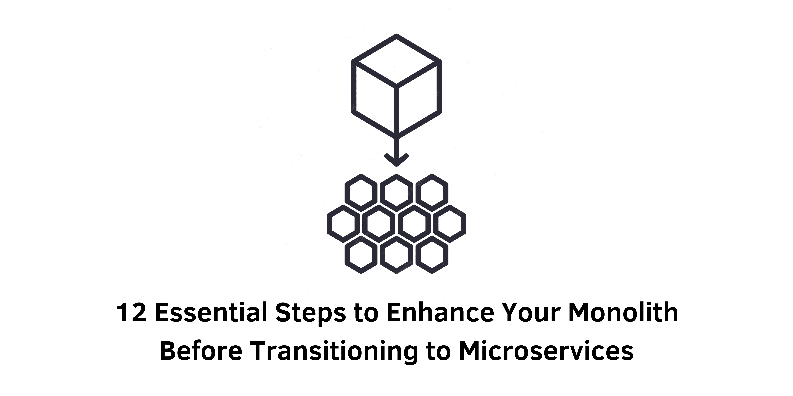

> Specification : Microservices, Transitioning, Monolith

## Introduction:
Transitioning from a monolithic architecture to microservices can be a complex endeavor. However, before completely discarding the monolith, it's essential to optimize and improve its functionality. This article provides 12 crucial tips to prepare your monolith for a smooth transition to microservices. By following these steps, you can ensure a successful migration while minimizing potential challenges.

### 1. Gain a Comprehensive Understanding:
Before embarking on the migration journey, thoroughly research microservices and evaluate whether they are the right fit for your organization. Understand the tradeoffs involved and explore example projects to grasp the fundamentals.

### 2. Develop a Migration Plan:
Create a comprehensive plan that outlines the steps involved in transitioning from a monolith to microservices. This plan should cover disentangling dependencies, identifying necessary microservices, designing data models, migrating data, ensuring backward compatibility, and establishing performance goals.

### 3. Implement a Monorepo:
Utilize a monorepo to manage code organization during the transition. By creating separate folders for microservices within the existing monolith repository, you can effectively track changes and recover from failures more efficiently.

### 4. Utilize a Shared CI Pipeline:
Set up a shared Continuous Integration/Continuous Delivery (CI/CD) pipeline to streamline the deployment and testing processes. Ensure the pipeline supports change-based execution and offers separate promotions for each microservice and the monolith.

### 5. Enhance Testing Practices:
Invest in automated testing to minimize regressions and ensure code quality. Follow the testing pyramid model, including a balance of unit tests, integration tests, and acceptance tests. Run tests frequently during development and within the CI/CD pipeline.

### 6. Implement an API Gateway or HTTP Reverse Proxy:
To route incoming traffic during the migration, consider implementing an API gateway or an HTTP reverse proxy. These tools allow you to direct requests to the appropriate endpoints, gradually transitioning from the monolith to microservices while maintaining functionality.

### 7. Explore the Monolith-in-a-Box Pattern:
Containerize your monolith using technologies like Docker. Running the monolith inside a container provides a standardized deployment approach and paves the way for future adoption of orchestration tools like Kubernetes.

### 8. Foster a Culture of Change:
Prepare your team for the transition by gradually introducing them to microservices. Start with smaller projects or edge services that have limited overlap with the monolith. Allow sufficient time for upskilling, learning, and adjusting to the distributed computing paradigm.

### 9. Leverage Feature Flags:
Implement feature flags to enable selective activation of functionality. This allows you to migrate specific features incrementally, experiment with different configurations, and conduct A/B testing. Gradually disable features in the monolith as corresponding microservices become stable.

### 10. Modularize the Monolith:
Before transitioning, modularize your monolith by breaking it into independent, vertically-stacked modules. This pattern reduces code dependencies, improves maintainability, and serves as a stepping stone towards microservices. Consider using patterns like the Strangler Fig or Anticorruption Layer to facilitate the modularization process.

### 11. Decouple Data:
Ensure each microservice has its own private and independent database. Decoupling data prevents dependencies between services and allows for autonomous operation. Establish mechanisms for data synchronization between the legacy database and microservices during the transition.

### 12. Enhance Observability:
Prioritize observability by implementing robust monitoring and logging practices. Install a centralized logging and monitoring service to capture metrics and logs from both the monolith and microservices. Establish a performance baseline for comparison between the old and new systems.

&nbsp;

## Conclusion:
Transitioning from a monolith to microservices requires careful planning and execution. By following these 12 steps, you can optimize your monolith, minimize risks, and ensure a smoother

&nbsp;
#### Reference:
- semaphore : https://semaphoreci.com/blog/monolith-microservices
