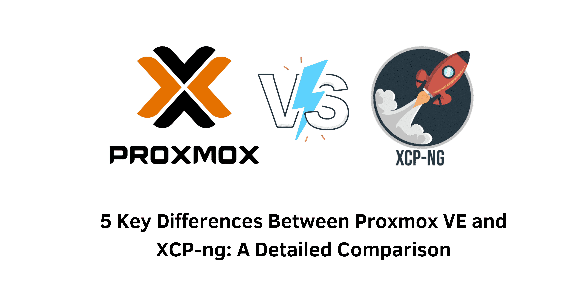

> A Detailed Exploration of Proxmox VE and XCP-ng

## Introduction
In the dynamic realm of IT infrastructure, virtualization platforms have become crucial for contemporary data centers. Among the various choices available, **Proxmox VE** and **XCP-ng** emerge as two of the most powerful and versatile options. Both platforms boast robust features, outstanding performance, and extensive management capabilities. This article will thoroughly examine the features, performance metrics, and management functionalities of Proxmox VE and XCP-ng to assist you in determining which platform aligns best with your requirements.

&nbsp;

### Proxmox VE: A Comprehensive Virtualization Solution
Proxmox VE is well-regarded for its integrated approach to virtualization, allowing users to manage both virtual machines and containers within a single platform. It utilizes KVM (Kernel-based Virtual Machine) for full virtualization and LXC (Linux Containers) for lightweight container support. This combination enables users to create a highly adaptable environment where virtual machines and containers can coexist effectively.

#### Key Features of Proxmox VE:
- **Unified Management Interface**: Proxmox VE features an intuitive web-based interface that simplifies the management of virtual machines and containers, making it accessible for users of all experience levels.
- **High Availability Clustering**: To minimize downtime, Proxmox VE supports high availability clustering, ensuring your services remain operational during hardware failures.
- **Advanced Storage Solutions**: With support for modern storage technologies such as Ceph and ZFS, Proxmox VE offers scalable storage solutions tailored to various needs.
- **Integrated Backup and Restore**: The platform includes built-in tools for backup and restoration, streamlining data protection and recovery processes.
- **Comprehensive API**: Proxmox VE provides a fully-featured REST API, enabling automation and management of your infrastructure through custom scripts and applications.

#### Proxmox VE System Requirements:
To run Proxmox VE effectively, your system should meet these specifications:
- **Processor**: 64-bit processor with virtualization extensions (Intel VT/AMD-V)
- **RAM**: Minimum of 4GB (8GB or more recommended)
- **Storage**: At least 32GB (128GB or more recommended)
- **Network**: Stable network connection
- **Operating System**: Compatible with Debian-based Linux distributions

### Performance and Installation: SSD vs HDD
When setting up Proxmox VE, the choice between SSD and HDD can significantly affect performance. SSDs provide faster data access, lower latency, and improved system responsiveness, making them ideal for running virtual machines. Conversely, HDDs are generally more affordable and offer larger storage capacities but at the expense of slower performance and longer boot times.

#### Proxmox VE Installation Comparison:
| Feature            | SSD                          | HDD                             |
|---------------------|------------------------------|---------------------------------|
| Performance         | Quick data access, reduced latency | Slower performance, longer boot times |
| Storage Capacity     | Smaller capacity              | Larger capacity                 |
| Cost                | More expensive                | More budget-friendly            |

#### Connecting to Proxmox VE:
To manage your Proxmox VE environment, simply enter the IP address or hostname of your Proxmox server in your web browser. Ensure a secure connection by using HTTPS. The Proxmox web interface offers comprehensive tools for creating virtual machines, managing resources, configuring networks, and handling backups.

&nbsp;

### Exploring XCP-ng: A Robust Xen-Based Virtualization Platform
XCP-ng, a successor to XenServer, provides a powerful and secure virtualization environment that utilizes Xen hypervisor technology. It serves as a cost-effective solution for organizations looking for robust virtualization capabilities without the high costs associated with proprietary software.

#### Key Features of XCP-ng:
- **Xen-Based Hypervisor**: XCP-ng leverages the robust Xen hypervisor, known for its security and efficiency in managing virtual environments.
- **Live Migration**: This capability allows the seamless transfer of virtual machines between hosts without downtime, ensuring uninterrupted service availability.
- **Xen Orchestra Integration**: Administrators can manage XCP-ng through Xen Orchestra, an advanced web-based interface that streamlines administrative tasks.
- **Extensibility**: XCP-ng supports functionality enhancements through plugins and add-ons, enabling customization to meet specific requirements.
- **Scalability**: The platform is designed to scale easily, making it suitable for both small setups and expansive data centers.

#### One Key Limitation: Lack of vGPU Support
Although XCP-ng excels in various aspects, it currently lacks support for virtual Nvidia GPU (vGPU), which can be a drawback for applications requiring GPU acceleration, such as machine learning or high-performance graphics workloads.

#### XCP-ng System Requirements:
To operate XCP-ng effectively, your system should meet the following criteria:
- **Processor**: 64-bit processor with virtualization extensions (Intel VT/AMD-V)
- **RAM**: Minimum of 4GB (8GB or more recommended)
- **Storage**: At least 32GB (128GB or more recommended)
- **Network**: Stable network connection
- **Operating System**: Compatible with Xen-based distributions

&nbsp;

### Comparative Analysis: Proxmox VE vs. XCP-ng
| Feature                     | Proxmox VE                   | XCP-ng                       |
|-----------------------------|------------------------------|------------------------------|
| Virtualization Technology    | KVM and LXC                  | Xen Hypervisor               |
| High Availability            | Yes                          | Yes                          |
| Backup and Restore           | Built-in tools               | Xen Orchestra integration     |
| Storage Solutions            | Ceph and ZFS support         | Basic storage options        |
| Management Interface         | Web-based GUI                | Xen Orchestra                 |
| Extensibility                | Comprehensive API            | Plugins and add-ons          |

&nbsp;

### Conclusion: Selecting the Right Virtualization Platform
When choosing between Proxmox VE and XCP-ng, it is essential to consider your unique requirements. Proxmox VE provides a versatile environment that supports both virtual machines and containers, making it suitable for enterprises that need robust storage and backup solutions. XCP-ng, with its powerful Xen hypervisor and cost-effective model, is ideal for organizations seeking a secure and scalable virtualization platform.

&nbsp;

### FAQ
**What is Proxmox VE?**  
Proxmox VE is an open-source virtualization platform that integrates virtual machines and containers to create a comprehensive solution for application management and deployment.

**What are the key features of Proxmox VE?**  
Key features of Proxmox VE include virtualization support, high availability clustering, advanced storage solutions, integrated backup and restore capabilities, and a comprehensive automation API.

**What are the system requirements for running Proxmox VE?**  
To run Proxmox VE, your system needs a 64-bit processor with virtualization extensions, at least 4GB of RAM, a minimum of 32GB of storage, a stable network connection, and compatibility with Debian-based Linux distributions.

**Should I choose SSD or HDD for Proxmox VE installation?**  
The choice depends on your budget, performance needs, and storage requirements. SSDs offer faster access and better responsiveness, while HDDs are typically more affordable and provide larger capacities.

**What is XCP-ng?**  
XCP-ng is an open-source virtualization platform built on the Xen hypervisor, providing a robust and secure environment for managing virtual machines.

**What are the key features of XCP-ng?**  
The main features of XCP-ng include its Xen-based hypervisor, live migration capability, Xen Orchestra integration, extensibility through plugins, and scalability.

**How does Proxmox VE compare to XCP-ng?**  
Both platforms deliver powerful virtualization solutions. Proxmox VE is recognized for its support for both virtual machines and containers, advanced storage options, and built-in backup tools, while XCP-ng excels with its Xen hypervisor, live migration features, and cost-effectiveness.

#### References
- Proxmox VE Documentation - [Proxmox VE](https://pve.proxmox.com/wiki/Main_Page)
- XCP-ng Documentation - [XCP-ng](https://xcp-ng.org/docs/)
- Ceph Documentation - [Ceph](https://docs.ceph.com/en/latest/)
- Xen Orchestra Documentation - [Xen Orchestra](https://xen-orchestra.com/)
