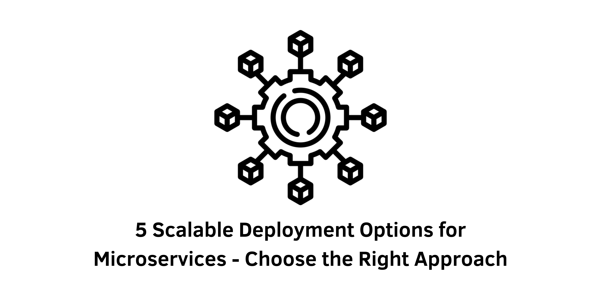

> Specification : Microservices, Architecture

## Introduction:
Explore five effective deployment options for microservices, including processes, containers, cloud-based solutions, orchestrators like Kubernetes, and the convenience of serverless deployments. Make an informed decision based on your application's scalability needs and optimize your microservice architecture.

### Option 1: Single Machine, Multiple Processes
Running microservices as processes on a single machine is a lightweight and convenient approach, ideal for small applications. Benefits include low overhead, ease of troubleshooting, and fixed billing. However, this option lacks scalability, has a single point of failure, and requires custom deployment scripts. It serves as a great starting point to learn the basics of microservices but may not suffice for larger applications.

### Option 2: Multiple Machines and Processes
Scaling beyond a single machine involves distributing microservices across multiple machines. Horizontal scaling enhances availability, but challenges arise, such as correlating log files, collecting metrics, handling upgrades, and managing traffic fluctuations. This option suits applications with spare machines and relatively simple services, but as complexity grows, containerization becomes necessary.

### Option 3: Deploying Microservices with Containers
Containers provide a solution to the challenges faced in direct process deployments. They offer isolation, concurrency, less overhead, and resource control. By encapsulating microservices in containers, deployment and monitoring become more manageable. Containers can be run directly on servers or through managed container services, such as AWS Fargate or Heroku. Managed services eliminate server management but may introduce vendor lock-in and resource limitations.

### Option 4: Orchestrators
Orchestrators like Kubernetes or Nomad excel at managing large-scale container deployments. With extensive features for container management, routing, security, and more, orchestrators are a popular choice for microservice architectures. Kubernetes, in particular, is widely supported and offers a codified desired state approach. However, the complexity of orchestrators, administrative burden, and the need for specialized skill sets are notable considerations. Managed Kubernetes clusters can ease the administrative workload.

### Option 5: Deploying Microservices as Serverless Functions
Serverless architectures, exemplified by AWS Lambda and Google Cloud Functions, offer an alternative approach. Running code on-demand in the cloud eliminates the need for servers, with easy scalability and pay-per-use billing. Serverless functions are convenient for prototyping and provide infinite scalability. However, downsides include vendor lock-in, potential cold start delays, limited resources and runtimes, and unpredictable billing.

&nbsp;

## Conclusion:
Choosing the right deployment method for microservices involves evaluating factors such as application size, scalability requirements, infrastructure management preferences, and the skill sets of the development team. The options discussed range from simple single-machine deployments to advanced orchestrators and serverless architectures. It is common for organizations to utilize a combination of deployment methods, leveraging bare-metal servers, virtual machines, Kubernetes, and serverless functions. By selecting the most suitable deployment option for each aspect of the application, developers can maximize the benefits of microservices while minimizing tradeoffs.

&nbsp;
#### Reference 
- semaphore : https://semaphoreci.com/blog/deploy-microservices
