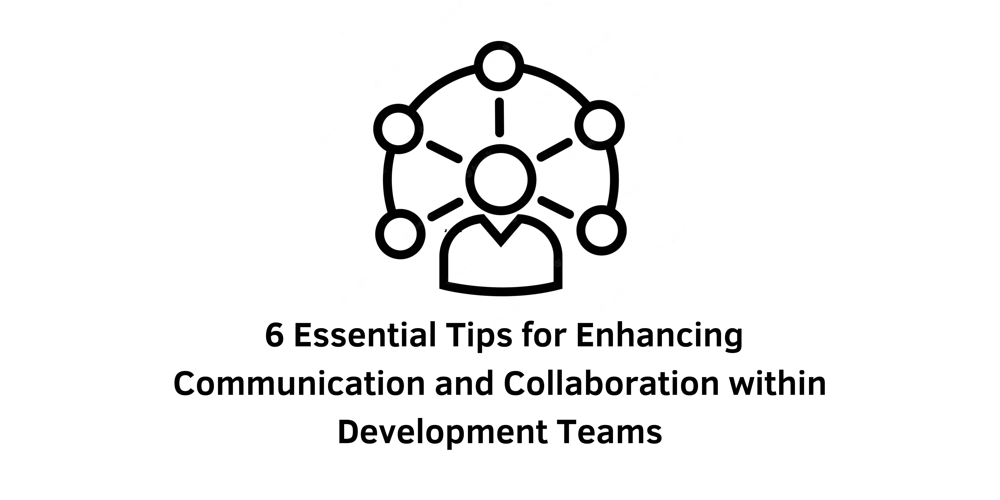

> Specification : Communication, Collaboration

## Introduction:
In today's complex business landscape, poor communication is a leading cause of failure, affecting around 86% of businesses. Within software development, where intricate technical concepts are discussed, and remote work is common, strong communication skills are critical for success. To help development teams overcome communication challenges, this article presents six practical tips to enhance collaboration and communication among team members.

### 1. Optimize Meetings for Productive Communication:
While collaboration tools have improved remote communication, meetings remain valuable for aligning team members and clarifying roles. However, it's crucial to conduct meetings with a clear purpose and structure. Ensure that only necessary participants are involved and create a structured agenda. Actively listen and engage during meetings, take notes, ask questions, discuss timelines, summarize key points, and end with a clear understanding of tasks and goals. Active participation fosters efficient communication and reduces errors.

### 2. Ask Open-Ended Questions:
While precise questions have their place, open-ended questions encourage meaningful discussions and enable exploration of ideas. During project planning or code reviews, instead of asking simple "yes" or "no" questions, inquire about the reasoning behind certain decisions or alternative approaches. Open-ended questions promote collaboration, uncover valuable insights, and prevent misunderstandings. When communicating remotely, ensure your written questions convey curiosity and respect, as tone can be misinterpreted.

### 3. Improve Planning and Estimation:
Effective planning is built on open communication. Foster an environment where team members can share ideas and provide input during feature mapping, prioritization, and issue tracking. Clearly communicate project timelines by establishing milestones, both major and minor. Encourage team members to provide task estimates, allowing for adjustments if needed. Regular check-ins help identify potential delays and address issues promptly. Additionally, maintaining comprehensive documentation facilitates shared understanding and efficient planning.

### 4. Embrace Agile Communication in Remote Settings:
To maintain an agile workflow while working remotely, effective communication becomes even more crucial. Foster an environment where team members have high ambient awareness of ongoing activities. Use daily stand-up meetings to keep everyone informed and leverage public chat channels to encourage informal discussions and idea sharing. Clearly differentiate between private and public communication channels to ensure transparency and inclusivity within the team.

### 5. Enhance Code Reviews:
Code reviews are an opportunity for effective collaboration and learning. Encourage early reviews to avoid overwhelming reviewers with numerous points of criticism. Provide comprehensive documentation and comments to clarify your intentions and highlight any specific constraints or areas requiring further discussion. Incorporate unambiguous ticket or bug IDs to provide context to reviewers. Leverage code reviews as an opportunity to seek advice or outside perspectives, fostering collaboration and knowledge sharing.

### 6. Excel in Remote Work Environments:
As remote work becomes more prevalent, mastering communication in distributed software teams is essential. McKinsey reports that increased team communication leads to improved relationships among team members. Actively apply skills such as active listening, open-ended questioning, and thorough code reviews in remote settings. Embrace collaboration tools and ensure intentional communication practices to maintain strong team bonds and effectively address challenges.

&nbsp;

## Conclusion:
Strong communication skills are indispensable for successful collaboration within development teams. By implementing these six practical tips, such as optimizing meetings, asking open-ended questions, improving planning and estimation, embracing agile communication, enhancing code reviews, and excelling in remote work environments, teams can foster effective communication, enhance collaboration, and achieve their goals. Investing in these soft skills will yield long-term benefits, enabling teams to work efficiently and maintain productivity in any work environment.

&nbsp;
#### Reference 
- semaphore : https://semaphoreci.com/blog/dev-team-communication
