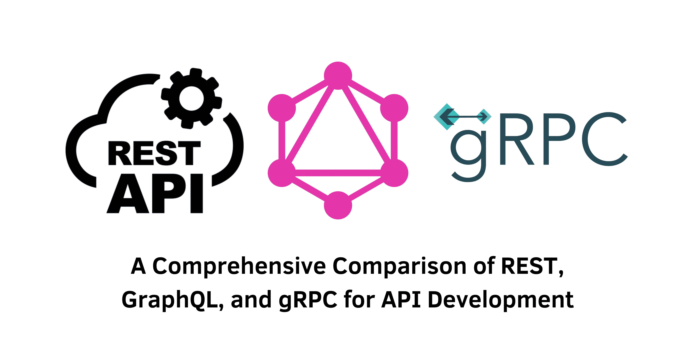

> Specification : API Development, REST, GraphQL, gRPC

## Introduction:
As an API developer, selecting the appropriate technology for your project is crucial. REST, GraphQL, and gRPC are three popular API development technologies, each with its own set of features and benefits. In this article, we will delve into an in-depth comparison of these technologies, covering performance, pros and cons, use cases, and how to choose the right technology for your project.

- **REST: Representational State Transfer**
REST is a widely adopted web-based architectural style for creating APIs. It utilizes HTTP requests (GET, POST, PUT, DELETE) and is known for its simplicity and scalability. REST APIs are stateless, cacheable, and accessible from various programming languages. The core principles of REST include statelessness, client-server separation, cacheability, layered system architecture, and a uniform interface.

- **GraphQL: Query Language for APIs**
GraphQL, developed by Facebook, is a query language for APIs. It allows developers to define the data requirements of an API request, providing flexibility and efficiency. With GraphQL, clients can request only the specific data they need, reducing over-fetching and under-fetching. GraphQL employs a strongly-typed schema, hierarchical data structure, client-driven queries, and a single endpoint.

- **gRPC: High-Performance API Development**
gRPC, created by Google, is a high-performance API development technology that utilizes Protocol Buffers for serializing structured data. gRPC APIs use HTTP/2 for transport, making them fast and efficient. Its core principles include Protocol Buffers serialization, strongly-typed contracts, bi-directional streaming, and language-agnostic support.

---
&nbsp;

## Pros and Cons of REST, GraphQL, and gRPC:
### **- REST**
**Pros:**
- Easy to learn and widely used
- Simple to cache and accessible from various programming languages

**Cons:**
- Less flexible compared to GraphQL
- Slower performance for large data sets
- Lack of a clear understanding of data requirements

&nbsp;

### **- GraphQL**
**Pros:**
- Flexible and efficient for complex data requirements
- Faster performance compared to REST due to selective data fetching
- Provides a clear understanding of data requirements

**Cons:**
- More complex than REST with a learning curve
- Limited community support compared to REST

&nbsp;

### **- gRPC**
**Pros:**
- High performance and scalability
- Language-agnostic with generated client libraries
- Efficient binary data encoding using Protocol Buffers

**Cons:**
- Limited community support compared to REST and GraphQL
- Requires knowledge of Protocol Buffers
- Not as widely used as REST and GraphQL

---
&nbsp;

## Use Cases for REST, GraphQL, and gRPC:
### **- REST**
- Simple CRUD operations
- Large data sets with infrequent updates
- Web applications requiring caching

**Famous Uses: Twitter API, GitHub API, Stripe API**

&nbsp;

### **- GraphQL**
- Complex data requirements
- Mobile applications with limited bandwidth
- Data-driven applications requiring flexibility

**Famous Uses: Facebook API, Shopify API, GitHub API v4**

&nbsp;

### **- gRPC**
- High-performance applications
- Microservices architecture
- Applications requiring high scalability

**Famous Uses: Google APIs, Netflix APIs, Cisco APIs**

&nbsp;

## Conclusion:
Choosing the appropriate API development technology is essential for building scalable, efficient, and reliable APIs. REST, GraphQL, and gRPC each have their strengths and use cases. By considering factors such as data transfer, performance, flexibility, and the specific requirements of your project, you can make an informed decision. Regardless of the technology you choose, ensure scalability, efficiency, and reliability for the success of your project.

&nbsp;
#### Reference:
- Design Gurus : https://www.designgurus.io/blog/REST-GraphQL-gRPC-system-design
