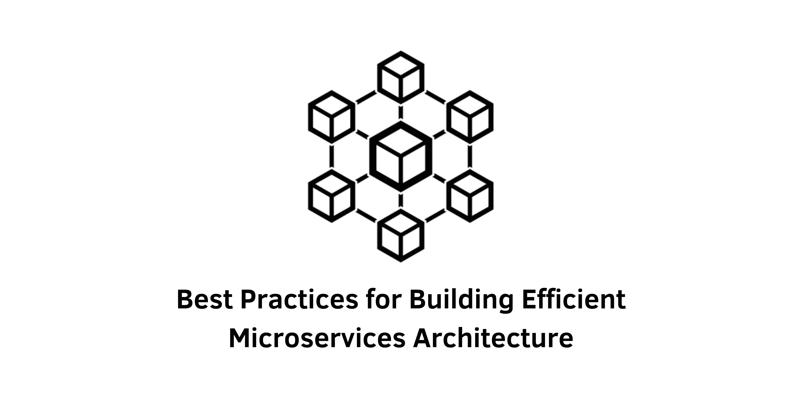

> Specification : Microservices, Cloud Computing

## Introduction:
Microservices architecture has revolutionized the development and management of server-side code, enabling faster development, maintainability, and scalability. However, implementing this pattern effectively requires adherence to certain best practices. In this article, we will explore the fundamental principles that can help you create an efficient microservices ecosystem while avoiding architectural complexities.

### 1. Adopt the Single Responsibility Principle:
The Single Responsibility Principle (SRP) emphasizes that each microservice should have a well-defined responsibility and should not try to accomplish too much. By adhering to SRP, you can achieve maintainable, scalable, and easier-to-understand code. Ensure that each microservice has a clear purpose and avoid unnecessary integration between services.

### 2. Build teams with clear responsibilities:
To develop a microservices architecture, it is crucial to build teams that have clear responsibilities. Consider establishing cross-functional teams comprising members from various roles, such as UI/UX developers, front-end developers, back-end developers, database admins, and QAs. This approach facilitates efficient communication, bug resolution, feature development, and deployment.

### 3. Use the right tools and frameworks:
Selecting the appropriate tools and frameworks is essential for successful implementation. Consider using tools like Jenkins, Docker, Postman, Kubernetes, Logstash, DevSecOps, and GitHub for automation, containerization, testing, deployment, monitoring, and code management. These proven technologies can significantly support your microservices architecture.

### 4. Keep asynchronous communication between microservices:
Maximize the use of asynchronous communication between microservices whenever possible. Asynchronous communication reduces dependencies and allows each service to complete its tasks independently, enhancing overall application efficiency. By leveraging tools like message queues or event-driven architectures, you can achieve loose coupling and improved scalability.

### 5. Adopt the DevSecOps model and secure microservices:
Security is paramount in microservices architecture. Implementing DevSecOps practices ensures continuous integration, continuous delivery, and increased security measures. This approach combines development, security, and operations to deliver high-quality, secure code efficiently. DevSecOps promotes security assurance, reduces vulnerabilities, enhances product quality, and increases productivity.

### 6. Use a separate data store for each microservice:
To reduce latency and improve security, consider using a separate data store for each microservice whenever possible. While shared database servers can be utilized for multiple services with logical separation, maintaining separate data stores provides better isolation and scalability. Minimize dependencies between microservices by ensuring their data remains private.

### 7. Deploy each microservice separately:
Deploying microservices independently offers numerous advantages, including streamlined coordination, ease of maintenance, and efficient upgrade efforts. Aim for dedicated infrastructures to isolate microservices and prevent cascading failures. Consider deploying multiple service instances per host, per container, or per virtual machine, depending on your specific needs.

### 8. Orchestrating microservices:
Orchestration is crucial for successful microservices architecture. Utilize container orchestration platforms such as Kubernetes, AKS, ECS, or Azure Container Apps to manage container provisioning, deployment, load balancing, scaling, and network communication. These platforms simplify the management of microservices and enhance overall system resilience.

### 9. Use an effective monitoring system:
Monitoring microservices is vital for ensuring their optimal performance and resource utilization. Implement a robust monitoring system that provides real-time insights into the health and performance of each service. Tools like AWS CloudWatch, Jaeger, Datadog, Graphite, and Prometheus offer comprehensive monitoring and observability solutions for microservices architectures.

&nbsp;

## Conclusion:
By adhering to these best practices, you can build an efficient microservices ecosystem that maximizes scalability, maintainability, and development speed. Embrace the principles of SRP, establish clear team responsibilities, choose the right tools and frameworks, promote asynchronous communication, prioritize security with DevSecOps.

---
&nbsp;

#### Reference 
- semaphore : https://semaphoreci.com/blog/microservices-best-practices
