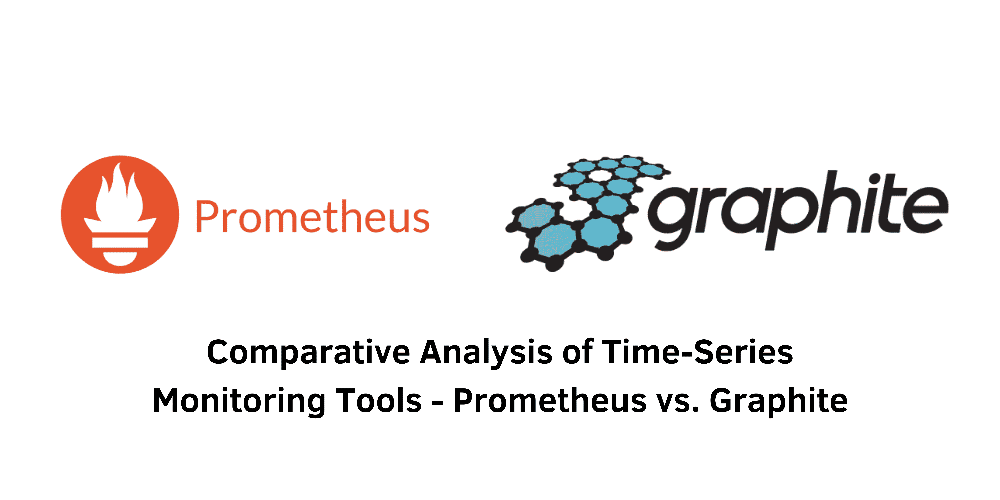

> Specification : Time Series, Monitoring Tools

## Introduction:
In the realm of modern system and application monitoring, time-series analysis stands as a pivotal technique for understanding trends, anomalies, and performance metrics over time. This article delves into the significance of time-series monitoring, its applications across various industries, and subsequently provides an in-depth comparison between two prominent tools in this domain - Prometheus and Graphite.

---
&nbsp;
### Time-series Monitoring: Importance and Applications
Time-series monitoring involves the continuous observation and analysis of sequential data, aiding in identifying patterns, deviations, and trends crucial for maintaining the health and performance of systems and applications. This method extends beyond mere error identification at a single point in time, enabling the detection of issues' origins and their ripple effects across processes.

The application of time-series data spans diverse sectors:

- Finance: Utilized for stock analysis, trading patterns, and economic indicators.
- IoT: Crucial for monitoring sensor data, enabling predictive maintenance and optimization.
- Healthcare: Vital in patient monitoring, disease progression analysis, and personalized treatment plans.
- Manufacturing: Used for process optimization, predictive maintenance, and quality control, among others.
- Telecommunications, Energy, Environment, Transportation: Each leverage time-series data for diverse purposes like network analysis, resource management, environmental monitoring, and logistics optimization.

### Prometheus vs. Graphite: Comparative Analysis

**1. Data Model:** Prometheus employs a flexible multidimensional model, while Graphite uses a hierarchical path-based model without inherent support for dimensions or labels.

**2. Metric Collection:** Prometheus employs a pull-based model, whereas Graphite predominantly relies on a push-based approach.

**3. Alerting:** Prometheus features a robust alerting system, unlike Graphite, which often relies on external tools like Grafana for alerting functionalities.

**4. Querying and Visualization:** Prometheus utilizes PromQL and provides basic visualization tools, while Graphite has its query language (GQL) and basic graphing capabilities, often complemented by Grafana.

**5. Service Discovery:** Prometheus supports dynamic service discovery, while Graphite focuses on data retention and storage flexibility.

**6. Integrations:** Both tools integrate well with Grafana, but Prometheus also integrates seamlessly with Kubernetes and other cloud-native ecosystem tools.

### Popular Applications Leveraging Prometheus and Graphite
Prometheus finds its application in Kubernetes monitoring and observability via the Prometheus Operator and Cortex for scalable, multi-tenant Prometheus implementations.

Graphite is used by major companies like Pinterest, Airbnb, and Shopify for monitoring various metrics across their infrastructure, applications, and user experiences.

&nbsp;

## Conclusion:
In conclusion, while both Prometheus and Graphite offer distinct monitoring capabilities, the choice between them largely hinges on specific organizational requirements. Prometheus boasts advanced querying, built-in alerting, and seamless integration with cloud-native tools, suitable for dynamic environments. On the other hand, Graphite focuses on simplicity and flexibility, making it favorable for organizations seeking specific functionalities or already entrenched in Graphite deployments.

Ultimately, the decision should align with your specific needs: Prometheus for comprehensive monitoring and shorter-term data retention or Graphite for focused storage and graphing requirements. Understanding these nuances ensures optimal selection based on your monitoring and analysis necessities.

&nbsp;
#### Reference:
- atatus : https://www.atatus.com/blog/prometheus-vs-graphite/