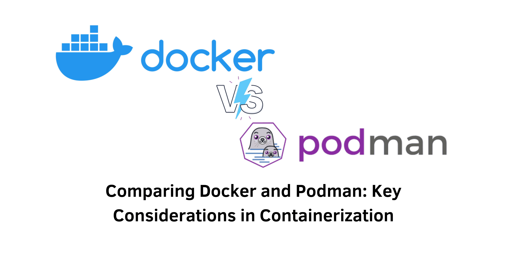

> Analyzing the Differences: Docker vs. Podman

## Introduction
In today’s software development landscape, containerization has emerged as a fundamental approach for creating, deploying, and managing applications. Among the myriad of containerization solutions available, **Docker** and **Podman** stand out as two of the most popular tools. Docker is well-known for its comprehensive feature set and a vast ecosystem, while Podman provides a lightweight, daemonless alternative that integrates seamlessly with Kubernetes. This article aims to compare these two containerization technologies by examining their functionalities, performance metrics, ecosystems, community support, and the most suitable use cases for each.

&nbsp;

### What is Docker?
Docker is a widely adopted containerization platform that enables developers to package applications along with all their dependencies into standardized units known as containers. These containers ensure that applications run consistently across different computing environments, making them invaluable for developers aiming to simplify deployment processes.

The architecture of Docker is based on a daemon model. The Docker daemon (dockerd) manages all container-related operations, including image creation, running, stopping, and resource allocation. In addition to its core functionality, Docker also features **Docker Hub**, the largest container image repository, which provides millions of pre-built images ready for deployment.

### Advantages of Docker
1. **User-Friendly Experience**: Docker is celebrated for its simplicity and user-friendly interface, allowing developers to create, manage, and distribute containers with minimal effort. The intuitive command-line interface helps streamline the development workflow and lowers the barrier to entry for newcomers.

2. **Rich Ecosystem**: Docker Hub offers an extensive library of pre-built images, which can drastically reduce the time and effort required for development. This extensive repository provides access to a wide variety of applications, libraries, and frameworks, enabling developers to build on existing resources rather than starting from scratch.

3. **Integration with Third-Party Tools**: Docker boasts a thriving ecosystem of third-party tools that complement its functionality. For instance, **Docker Compose** simplifies the management of multi-container applications, while CI/CD tools enhance integration and deployment processes, allowing for more efficient workflows.

&nbsp;

### What is Podman?
Podman is an alternative containerization tool developed by Red Hat. It offers many of the same functionalities as Docker but adopts a different architectural approach. Notably, Podman operates without a daemon, allowing for more efficient management of container lifecycles.

This daemonless operation means that Podman can directly execute commands for creating and managing containers, leading to reduced resource overhead. Furthermore, Podman leverages existing technologies such as **libpod** and **runc** to manage containers, allowing for enhanced compatibility and flexibility.

### Advantages of Podman
1. **Daemonless Architecture**: Podman's lack of a daemon means that it does not require a constantly running background service, which can lower resource consumption significantly. This makes Podman particularly suitable for resource-constrained environments or situations where overhead needs to be minimized.

2. **Enhanced Security Features**: A key security advantage of Podman is its ability to run containers as non-root users. This feature reduces the attack surface and enhances security, making Podman an excellent choice for environments that prioritize strict user privileges and security measures.

3. **Seamless Kubernetes Integration**: Podman can directly interface with Kubernetes, enabling developers to deploy and manage containers effortlessly within Kubernetes clusters. This integration simplifies workflows for teams transitioning from development to production, enhancing efficiency.

&nbsp;

### Performance Comparison: Docker vs. Podman
#### Resource Utilization
Docker's daemon-based architecture can lead to higher resource utilization compared to Podman’s design. The Docker daemon manages container operations, which may consume additional CPU and memory. On the other hand, Podman's daemonless model minimizes extra resource requirements, making it more efficient, especially in environments with many containers running simultaneously.

#### Startup Time
Podman generally exhibits faster startup times than Docker, primarily due to the absence of a daemon process. This enables Podman to launch containers more quickly, improving responsiveness. While Docker performs efficiently, it may have slightly longer initialization times owing to the overhead of starting and managing the Docker daemon.

#### Overall Efficiency
In benchmark tests and real-world applications, both Docker and Podman showcase strong performance and reliability. The choice between the two often depends on specific performance requirements, compatibility needs, and personal workflow preferences.

&nbsp;

### Ecosystem and Community Support: Docker vs. Podman
#### Docker Ecosystem
The Docker ecosystem is broad and mature, offering a wealth of resources and tools that enhance its functionality. Key elements include:

- **Docker Hub**: As the largest repository of container images, Docker Hub provides millions of ready-to-use images, simplifying the process of finding and deploying applications.

- **Official Repositories**: Docker's numerous official repositories offer curated images, ensuring developers have access to high-quality and trusted resources.

- **Third-Party Tool Support**: Docker benefits from a vibrant ecosystem of third-party tools that improve development workflows, including Docker Compose for managing multi-container setups and various CI/CD solutions.

#### Podman Ecosystem
While Podman's ecosystem is not as extensive as Docker's, it is continually evolving. Key aspects include:

- **Limited Pre-built Images**: Currently, Podman has fewer pre-built images available compared to Docker Hub, often requiring users to create images from scratch for specific applications.

- **Growing Support for Third-Party Tools**: The ecosystem for Podman is expanding, with an increasing number of tools emerging to support multi-container management and operational workflows.

- **Official Image Repositories**: Similar to Docker, Podman has official repositories that offer reliable images, ensuring users can access dependable resources for their applications.

&nbsp;

### Ideal Use Cases and Compatibility
#### Ideal Use Cases for Docker
- **Established Development Workflows**: For teams that have integrated Docker into their existing development processes, sticking with Docker minimizes disruptions and maintains a smooth operational flow.

- **Need for Pre-built Images**: If a project requires a variety of pre-built images, Docker’s extensive library on Docker Hub makes it an ideal choice, saving time during development and deployment.

- **Complex Deployments**: Docker Swarm is advantageous for managing and scaling complex deployments across clusters, making Docker suitable for intricate setups involving multiple interconnected containers.

#### Ideal Use Cases for Podman
- **Security-Focused Environments**: Podman’s capability to run containers as non-root users makes it preferable in environments that demand high security, thereby minimizing vulnerabilities.

- **Resource-Constrained Scenarios**: Podman’s lightweight, daemonless architecture is especially useful in environments where resource efficiency is critical, allowing for more effective utilization of available resources.

- **Integration with Systemd**: For users in systemd-based environments, Podman provides significant advantages due to its seamless integration, simplifying container management tasks within such infrastructure.

Both Docker and Podman support compatibility with container images from each other, allowing users to utilize Docker images with Podman and vice versa. However, it’s advisable to review image documentation for any specific compatibility considerations.

&nbsp;

### Conclusion
Choosing between Docker and Podman ultimately hinges on your organization’s specific needs and preferences. Docker provides a robust platform with a well-established ecosystem and extensive community support, making it a reliable choice for many projects. Conversely, Podman offers a lightweight, secure, and daemonless alternative that may be better suited for specific use cases, particularly in Kubernetes environments.

By carefully evaluating your organization’s objectives, security requirements, and resource constraints, you can make an informed decision regarding the adoption of Docker or Podman as part of your containerization strategy.

#### References
- Official Docker Documentation: [Docker Docs](https://docs.docker.com/)
- Podman Documentation: [Podman Docs](https://podman.io/getting-started/overview)
