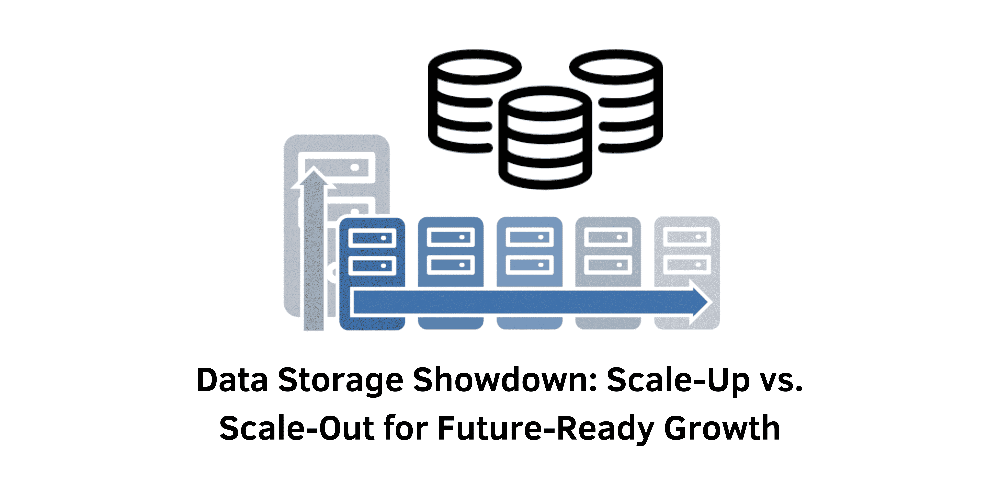

> In today's fast-evolving digital landscape, managing data storage efficiently is critical for organizations aiming for sustainable growth. The choice between scale-up and scale-out strategies significantly influences how businesses handle their data needs. This article delves into the nuances of these two approaches, highlighting their benefits and drawbacks to help you make an informed decision that aligns with your organization's future growth plans.

## What is Scale-Up?

Scale-up, often termed vertical scaling, refers to the practice of enhancing an existing storage system by adding more resources—like RAM, CPU, or hard drives—to a single server. This method typically involves managing storage drives through a limited number of controllers, with the option to add additional units once maximum capacity is reached. 

In essence, scale-up means making a single machine more powerful. This is a traditional approach that many organizations have relied on for years. It's straightforward: if you need more storage or processing power, you just add more components to the existing system.

### Advantages of Scale-Up

1. **Cost-Effectiveness**: By upgrading a single, larger server, organizations can often save on initial costs compared to deploying multiple new servers. This makes scale-up an attractive option for businesses with limited budgets. Additionally, the reduced complexity in vendor management and fewer purchase orders can simplify financial planning.

2. **Simplified Maintenance**: Maintaining one storage system streamlines management tasks, making it easier to oversee data quality and perform updates without the complexities of multiple systems. With only one system to monitor, IT teams can focus on optimizing that system rather than juggling several different environments.

3. **Quicker Response Times**: A single node handling all services minimizes the need for synchronization, resulting in faster data processing and improved performance, especially in latency-sensitive environments. This is particularly advantageous for applications where speed is critical, such as financial transactions or real-time data analytics.

### Disadvantages of Scale-Up

1. **Scalability Constraints**: As demands increase, the physical limits of a single server can impede growth, creating bottlenecks that affect performance and recovery processes. Once you hit the maximum capacity of a scale-up solution, you may be forced to invest in an entirely new system, which can be a significant expense.

2. **Potential Downtime**: Upgrading can lead to significant downtime, disrupting business operations. Migrating data during an upgrade is labor-intensive and can be challenging. Organizations often have to plan for maintenance windows, which can affect productivity and service availability.

&nbsp;

## What is Scale-Out?

Scale-out, or horizontal scaling, leverages software-defined storage (SDS) to decouple hardware from software control. This strategy involves clusters of software nodes that can be easily added or removed, allowing organizations to flexibly adjust bandwidth and computing resources as needed. Rather than enhancing the power of a single server, scale-out focuses on adding more servers to the existing network, spreading out the workload.

This method is increasingly popular among organizations that deal with vast amounts of data or require high availability and reliability.

### Advantages of Scale-Out

1. **Superior Performance**: Distributing workloads across multiple servers enhances overall system performance, reducing the likelihood of bottlenecks and ensuring efficient handling of large data volumes. With multiple nodes working together, even heavy workloads can be managed smoothly.

2. **Flexible Scalability**: Scale-out enables organizations to expand their infrastructure incrementally, allowing for rapid adjustments without significant upfront investments. Businesses can add resources as they grow, which is particularly valuable in industries with fluctuating demands.

3. **Continuous Availability**: Upgrades can be performed without downtime, ensuring uninterrupted service and maintaining user satisfaction. This capability is crucial for businesses that operate 24/7, as it prevents service interruptions that can lead to lost revenue and customer dissatisfaction.

### Disadvantages of Scale-Out

1. **Increased Complexity**: Managing a distributed system can be more challenging than overseeing a single server, necessitating effective load balancing and synchronization strategies. IT teams need to ensure that all nodes work seamlessly together, which may require specialized skills and additional training.

2. **Higher Initial Costs**: While scale-out offers long-term benefits, the initial costs of purchasing new servers can be significant, which may be a consideration for budget-constrained organizations. The upfront investment can be daunting, especially for smaller businesses looking to expand.

&nbsp;

## Choosing Between Scale-Up and Scale-Out

Selecting between scale-up and scale-out hinges on your organization's specific requirements. Here are several critical factors to consider:

- **Growth Projections**: If you anticipate steady, long-term growth, scale-out may be the preferable option. This approach is designed for scalability and can adapt to increased data needs over time. Conversely, if your growth is sporadic or short-term, scale-up might suffice.

- **Budget Considerations**: Scale-up is typically more cost-effective initially. However, consider the long-term financial implications, including potential downtime costs. It's important to evaluate not just the immediate costs but also the total cost of ownership over time.

- **Workload Types**: High-volume, mission-critical workloads often benefit from the reliability and performance of scale-out solutions. If your applications require high availability, scale-out is likely the better option.

- **Traffic Patterns**: Scale-out is ideal for environments with persistent high demand, whereas scale-up can efficiently manage temporary spikes. If your organization experiences unpredictable traffic, having a flexible scale-out architecture could be beneficial.

&nbsp;

## Conclusion

Deciding between scale-up and scale-out storage strategies is crucial for organizations looking to future-proof their data infrastructure. Scale-up offers a straightforward, cost-effective solution for moderate growth, while scale-out provides enhanced performance, reliability, and flexibility for businesses anticipating significant data expansion.

In an era where data is king, organizations must choose a strategy that not only meets their current needs but also positions them for future success. By assessing your organization's long-term goals, budget constraints, and workload requirements, you can make a strategic choice that aligns with your operational needs and ensures your organization thrives in an increasingly data-driven world.

#### References

- **Gartner**. (2023). "Storage Scalability: Understanding Scale-Up vs. Scale-Out."
- **Forrester**. (2024). "Modernizing Data Storage: Scale-Up or Scale-Out?"
- **IDC**. (2024). "Data Storage Trends: Best Practices for Scaling."
- **TechTarget**. (2024). "Comparing Scale-Up and Scale-Out Architectures."
- **IBM**. (2024). "Choosing the Right Storage Architecture for Your Business."