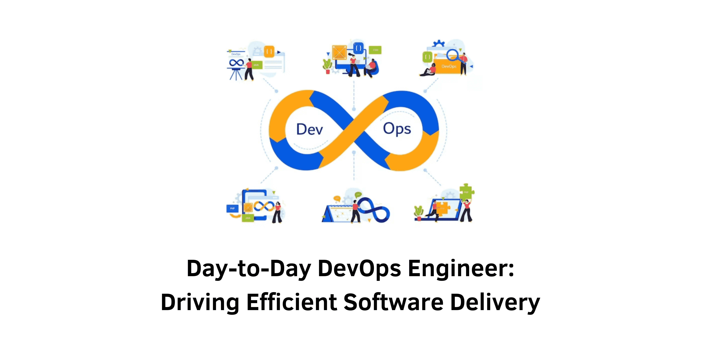

> Specification :  Documentation, Collaboration, Infrastructure Management, Troubleshooting

## Introduction:
DevOps engineers play a critical role in modern software development by bridging the gap between development and operations teams. Their primary focus is on creating efficient and automated processes to enable continuous integration and continuous delivery (CI/CD). In this article, we will explore the day-to-day activities of a DevOps engineer, highlighting the key responsibilities and challenges they face.

### 1. Pipeline Management
A DevOps engineer's top priority is ensuring the smooth operation of the CI/CD pipeline. This involves monitoring, troubleshooting, and resolving any issues or failures that may arise. Rigorous testing and validation are essential to maintain a stable pipeline that delivers code changes reliably and consistently.

### 2. Collaboration with Other Teams
Successful DevOps implementation relies on effective communication and collaboration with various teams, including development, quality assurance (QA), program management, and IT. Regular interactions and coordination are necessary to understand the requirements and deliverables from each team.

### 3. Automation Initiatives
Automation lies at the core of DevOps practices. DevOps engineers spend considerable time planning, developing, and implementing automation solutions. Automating repetitive tasks, configuration management, and infrastructure provisioning are key areas of focus to enhance productivity and reduce manual errors.

### 4. Infrastructure Management
DevOps engineers are responsible for managing the infrastructure that supports the CI/CD pipeline. This includes ensuring high availability, setting up new platforms, and implementing robust backup strategies to safeguard critical data.

### 5. Dealing with Legacy Systems
In many cases, DevOps engineers must work with legacy systems that require ongoing support or migration to modern platforms. Addressing the challenges posed by legacy infrastructure is essential to maintain a seamless development and deployment environment.

### 6. Exploring New Tools and Technologies
The DevOps landscape is continuously evolving, with new open-source tools and technologies emerging regularly. DevOps engineers dedicate time to explore and evaluate these options to keep costs at a minimum while maximizing efficiency.

### 7. Identifying and Eliminating Bottlenecks
A core objective of DevOps is to identify and remove bottlenecks in the development and deployment process. DevOps engineers collaborate with all stakeholders to streamline workflows, reduce manual handoffs, and improve overall efficiency.

### 8. Documentation and Reporting
While Agile and DevOps emphasize lightweight documentation, certain artifacts remain crucial for effective operations. DevOps engineers maintain documentation related to server information, project progress, infrastructure configurations, and other critical details.

### 9. Training and Self-Development
Continuous learning is a vital aspect of a DevOps engineer's career. Organizations encourage employees to invest time in self-development, and DevOps engineers actively seek training opportunities to stay updated with the latest tools, practices, and methodologies.

### 10. Fostering a Culture of Continuous Improvement
DevOps engineers champion the adoption of CI/CD practices and advocate for a culture of continuous improvement within the organization. By optimizing existing resources and processes, they aim to enhance productivity, quality, and overall project success.

&nbsp;

## Conclusion:
In conclusion, the role of a DevOps engineer is multifaceted and critical to the success of modern software development. From ensuring a seamless CI/CD pipeline to fostering a culture of continuous improvement, they play a pivotal role in streamlining operations and delivering high-quality software at speed. Embracing automation, collaboration, and continuous learning, DevOps engineers remain at the forefront of transforming software development practices for a digital age.

&nbsp;
#### Reference:
- Medium : @AnnAfame
