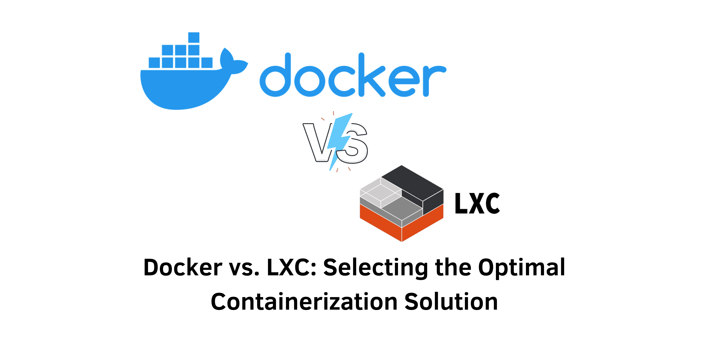

> An In-Depth Comparison: Docker and LXC

## Introduction
Containerization has transformed the software development landscape, enabling developers to encapsulate applications along with their dependencies into distinct units known as containers. Among the various solutions available, **Docker** and **LXC** (Linux Containers) are two prominent technologies that facilitate this process through different methodologies. Understanding the distinctions between Docker and LXC can guide you in selecting the right tool to optimize your development workflows, resource utilization, and system performance.

&nbsp;

### Understanding Docker
Docker is an open-source platform designed to provide developers with tools for building, deploying, and managing containerized applications. Docker containers package applications along with their dependencies into a single, portable unit, ensuring that they run consistently across diverse environments. Key features of Docker include:

- **Portability**: Docker containers operate seamlessly on any system with Docker installed, eliminating compatibility challenges.
- **Speed and Efficiency**: By sharing the host system’s kernel, Docker containers offer quicker startup times and lower resource consumption compared to traditional virtual machines.
- **Isolation**: Docker guarantees that containers remain isolated from each other and the host system, creating a secure operating environment.
- **Image Registry**: Docker Hub is a repository that hosts numerous pre-built Docker images, allowing developers to leverage existing resources.
- **Orchestration**: Docker can integrate with orchestration tools like Docker Swarm and Kubernetes, facilitating the management of complex deployments involving multiple containers.

### Benefits of Docker
1. **Streamlined Development and Testing**: Docker allows developers to create consistent environments, ensuring that applications function properly across different stages of development.
2. **Accelerated Deployments**: With pre-built images and simplified management, Docker expedites the deployment process.
3. **Enhanced Scalability**: Docker makes it easy to scale applications, enabling the rapid deployment of additional containers to accommodate increased workloads.
4. **Microservices Compatibility**: Docker’s lightweight containers are particularly well-suited for constructing and deploying applications based on microservices architecture.

&nbsp;

### Understanding LXC
LXC, or Linux Containers, is another form of containerization technology that creates isolated environments within Linux systems. Unlike Docker, which primarily relies on the host kernel, LXC operates at the kernel level, offering unique features and use cases.

LXC utilizes Linux kernel features such as namespaces and cgroups to create containers that can contain a complete Linux environment, including their own user space and potentially a separate kernel. Important features of LXC include:

- **Flexibility**: LXC provides granular control over the container environment, allowing adjustments in resource allocation, networking settings, and root filesystem configurations.
- **Security**: LXC can achieve higher levels of isolation by utilizing separate kernels, making it suitable for security-sensitive applications.
- **Resource Management**: LXC enables precise definitions of resource limits for each container, ensuring efficient resource utilization.

### Benefits of LXC
1. **Support for Legacy Applications**: LXC can isolate and run legacy applications that require specific system configurations.
2. **Optimized for High-Performance Computing**: LXC’s control and isolation capabilities make it ideal for high-performance computing workloads.
3. **Security-Focused Deployments**: With its ability to run containers with separate kernels, LXC enhances security, making it suitable for environments that demand maximum isolation.

&nbsp;

### Docker vs. LXC: Performance Comparison
The choice between Docker and LXC often hinges on whether you prioritize speed and simplicity or control and isolation.

#### Resource Usage and Efficiency
- **Docker**: By sharing the host kernel, Docker containers typically have faster startup times and lower resource consumption, which is ideal for rapid deployments and scalability.
- **LXC**: While potentially more resource-intensive due to the use of separate kernels, LXC provides fine-grained control over resource allocation, which can be advantageous for specific workloads.

#### Speed
- **Docker**: Docker containers generally have faster startup times due to their lightweight nature, making them suitable for frequent deployments.
- **LXC**: Containers using LXC may experience longer boot times, particularly when utilizing separate kernels, which can be a drawback in scenarios requiring quick restarts.

&nbsp;

### Docker vs. LXC: Ease of Use
The user-friendliness of Docker and LXC significantly affects their adoption and operational efficiency.

#### Installation and Setup
- **Docker**: Installation is straightforward, with packages available for various operating systems, and Docker Compose simplifies multi-container orchestration.
- **LXC**: While available through package repositories on many Linux distributions, LXC requires more manual configuration, particularly regarding networking and storage.

#### Configuration and Management
- **Docker**: Offers an intuitive command-line interface (CLI) along with GUI tools such as Docker Desktop, which simplifies container and image management. Docker Compose is particularly useful for defining multi-container applications.
- **LXC**: Managed through the lxc command-line tool, LXC allows for powerful customization but typically requires more manual intervention compared to Docker.

#### User-Friendly Interfaces and Tools
- **Docker**: Has a rich ecosystem of tools including Docker Hub, Docker Swarm, and Docker Desktop that enhance its usability.
- **LXC**: Primarily managed via the lxc command-line tool and integrates well with standard Linux utilities.

#### Documentation and Community Support
- **Docker**: Boasts extensive documentation and a large, active community that provides a wealth of resources, tutorials, and forums for support.
- **LXC**: Although it has decent documentation, the community is smaller, which may limit the availability of support resources.

&nbsp;

### Docker vs. LXC: Isolation and Security
Isolation and security are vital aspects of containerization technologies.

#### Isolation Mechanisms
- **Docker**: Employs namespaces and cgroups for isolation, sharing the host kernel, which could pose risks if the host kernel is compromised.
- **LXC**: Provides additional isolation by using separate kernels, creating a stronger barrier between the containers and the host system.

#### Security Vulnerabilities and Concerns
- **Docker**: Its widespread popularity makes it a more significant target for attackers, and security misconfigurations can lead to vulnerabilities.
- **LXC**: Although it has a smaller user base, LXC still requires adherence to security best practices to mitigate risks.

&nbsp;

### Docker vs. LXC: Ecosystem and Community Support
The surrounding ecosystem and community support play essential roles in the usability of Docker and LXC.

#### Ecosystem and Tooling
- **Docker**: Features a robust ecosystem that includes Docker Hub, Docker Compose, and orchestration tools like Kubernetes.
- **LXC**: While it integrates well with the Linux ecosystem, LXC lacks the extensive tooling and integration options available with Docker.

#### Pre-built Images and Plugins
- **Docker**: Hosts thousands of pre-built images on Docker Hub and supports a wide array of plugins, enhancing its flexibility.
- **LXC**: Currently has limited access to pre-built images and plugins, often requiring manual configuration.

#### Community Support
- **Docker**: Benefits from a large, active community providing extensive online resources and support.
- **LXC**: Has a dedicated community, but the support resources available are more limited.

&nbsp;

### Conclusion
Both Docker and LXC are powerful containerization solutions, each with its unique strengths and weaknesses. Docker shines in its ease of use, portability, and speed, making it particularly well-suited for rapid deployments and microservices architectures. In contrast, LXC offers greater control and isolation, making it a better choice for legacy applications, high-performance computing needs, and environments requiring stringent security measures. Ultimately, the choice between Docker and LXC will depend on your specific requirements, whether you prioritize rapid scalability or detailed control over your containerized environments.

#### References
- Docker Official Documentation: [Docker Docs](https://docs.docker.com/)
- LXC Official Documentation: [LXC Docs](https://linuxcontainers.org/lxc/introduction/)
