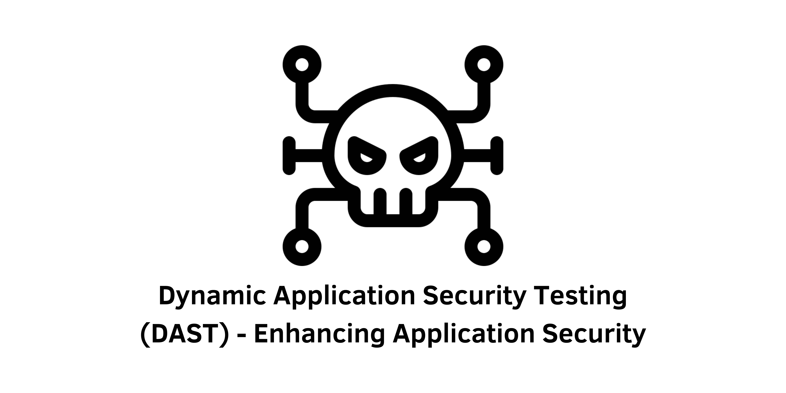

> Specification : Security, DAST, Tools, Open Source

## Introduction:
Dynamic Application Security Testing (DAST) tools play a vital role in identifying vulnerabilities in running applications. As software development continues at a rapid pace, incorporating security testing into the DevSecOps pipeline becomes crucial. DAST tools offer real-time vulnerability detection by simulating attacks and analyzing application responses. This article provides an in-depth understanding of DAST tools, their types, popular options, and best practices for effective implementation.

&nbsp;

### Understanding Dynamic Application Security Testing:
Dynamic Application Security Testing involves real-time vulnerability analysis of running applications. By simulating attacks and examining an application's inputs and outputs, DAST tools can uncover vulnerabilities that might be missed during static analysis or code reviews. These tools are highly automated, making them suitable for integration within continuous integration and continuous delivery (CI/CD) pipelines. Furthermore, they generate comprehensive reports containing vulnerability details, severity levels, and recommended remediation steps.

### Types of DAST Tools:
1. Black-box testing tools: These simulate external attackers with no internal knowledge of the application. They rely solely on inputs and outputs to identify vulnerabilities, making them ideal for testing externally-facing applications like web applications.

2. Grey-box testing tools: These simulate attackers with limited internal knowledge of the application, such as database schemas or API endpoints. Grey-box tools are suitable for testing web applications and APIs.

3. White-box testing tools: These tools have full access to the application's internal structure, including the source code. They analyze the code to identify potential vulnerabilities, making them valuable for testing custom-built applications.

### Popular DAST Tools:
1. **OWASP ZAP**: This free and open-source DAST tool is widely used for its comprehensive features, including active and passive scanning, advanced spidering, and scriptable attacks. It offers easy integration with other tools through a powerful API.

2. **Burp Suite**: As a popular commercial DAST tool, Burp Suite provides a range of features for web application security testing, such as automated scanning, manual testing, and advanced penetration testing. It also offers seamless integration with other tools.

3. **Acunetix**: Acunetix is a commercial DAST tool known for its comprehensive web application security testing capabilities. It can detect various vulnerabilities, including SQL injection and cross-site scripting (XSS). Acunetix also provides advanced reporting and integration features.

4. **AppSpider**: AppSpider is another commercial DAST tool that offers comprehensive web application security testing. It excels in detecting vulnerabilities like SQL injection and XSS, along with robust reporting and integration capabilities.

### Best Practices for Using DAST Tools:
1. Understand the application and its architecture: Gain a clear understanding of the application's inputs, outputs, and third-party components to configure the DAST tool effectively.

2. Use DAST tools in conjunction with other security testing tools: Combine DAST with tools like Static Application Security Testing (SAST), manual testing, and vulnerability scanners for a more comprehensive security assessment.

3. Prioritize vulnerabilities: Once identified, prioritize vulnerabilities based on severity and potential impact to address the critical ones first.

4. Configure DAST tools effectively: Customize DAST tools by specifying testing scopes, types of inputs, and vulnerability thresholds to achieve optimal results.

5. Conduct regular testing: Perform DAST testing regularly, particularly after new releases or significant application changes, to promptly detect and address any emerging vulnerabilities.

&nbsp;

## Conclusion:
Dynamic Application Security Testing (DAST) tools are indispensable in ensuring application security within the DevSecOps pipeline. By incorporating DAST tools like OWASP ZAP and following best practices, organizations can identify and remediate vulnerabilities effectively. Prioritizing application security, using a combination of testing methods, and conducting regular scans will contribute to a robust and secure application environment. Implement DAST tools today to proactively minimize security risks and safeguard your applications.

&nbsp;
#### Reference:
-  semaphore : https://semaphoreci.com/blog/dast-tools#best-practices-for-using-dast-tools