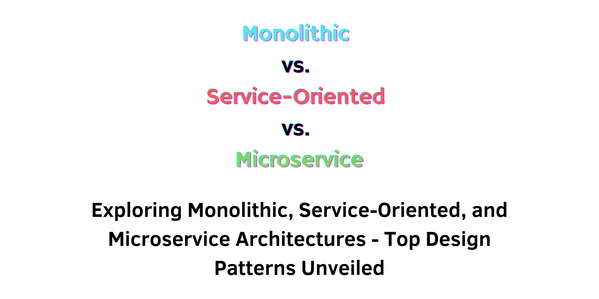

> Specification : Design Patterns, Monolithic, Service-Oriented, Microservice

## Introduction:
In today's technology-driven era, the architectural blueprint of software systems stands as a cornerstone determining system efficiency, adaptability, and future readiness. The software engineering landscape is replete with diverse architectural paradigms, among which Monolithic, Service-Oriented (SOA), and Microservices take center stage.

Tailoring the right architectural style to unique project requisites is pivotal. This article endeavors to dissect and compare these three architectural designs, shedding light on their strengths, weaknesses, and optimal use scenarios. Whether you're a seasoned developer, an aspiring student navigating the realms of software architecture, or an entrepreneur seeking the best fit for your tech venture, this guide is tailored for you.

---
### Exploring Architectural Styles:
**(+) Monolithic Architecture:**

The traditional approach bundling UI, logic, and data access tightly. Benefits include ease of development, but it poses challenges in scaling and updates due to interdependencies.

**(+) Service-Oriented Architecture (SOA):**

Structured around reusable, network-accessible services fostering reusability. However, complexities might arise with an Enterprise Service Bus (ESB) as a single point of failure.

**(+) Microservice Architecture:**

Embraces loosely-coupled, independent services promoting flexible deployment. Offers scalability but demands meticulous coordination and poses challenges in testing and data consistency.

&nbsp;
### Top Design Patterns for Architectural Styles:
**Monolithic Architecture Design Patterns:**

- Layered Pattern
- Model-View-Controller (MVC)
- Pipe and Filter
- Client-Server
- Blackboard

**Service-Oriented Architecture Design Patterns:**

- Service Registry
- Enterprise Service Bus (ESB)
- Service Facade
- Message Bus
- Composite Services

**Microservices Architecture Design Patterns:**

- API Gateway
- Circuit Breaker
- Saga
- Service Discovery
- Event-Driven Architecture

&nbsp;
## Conclusion:
Selecting the right architecture—Monolithic, SOA, or Microservices—hinges on a nuanced understanding of project specifics. Each architecture exhibits distinct merits and trade-offs, demanding a careful evaluation based on factors like simplicity, scalability, and long-term objectives.

Architectural patterns serve as tools, not constraints, streamlining our work efficiency. Optimal architecture selection is not about chasing trends; it's about aligning with application needs, team expertise, and organizational goals. It's foresight in anticipating changes and making choices conducive to adaptability.

In the ever-evolving software domain, the evolution and understanding of architectural paradigms persist. Stay informed, adaptive, and receptive to learning. As developers, our mission remains crafting efficient, user-serving software, where architecture plays an integral role in achieving this objective.

&nbsp;
#### Reference:
- Design Gurus : https://www.designgurus.io/blog/Monolithic-Service-Oriented-Microservice-Architecture