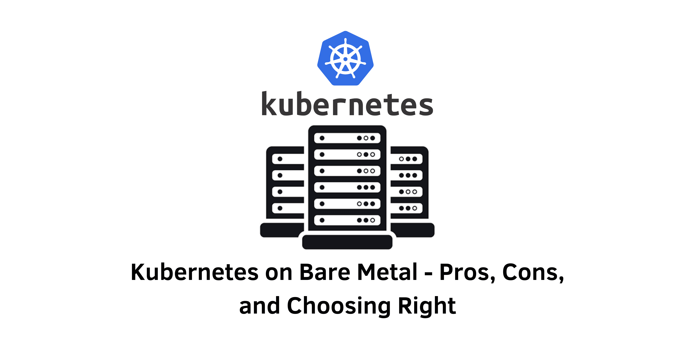

> Specification : Kubernetes, Microservices, Cloud Computing

## Introduction:
Living in a software-defined world, the choice of running Kubernetes on bare metal may seem unconventional. However, there are compelling reasons to consider bare-metal Kubernetes clusters. In this blog post, we delve into the benefits and drawbacks of leveraging bare-metal servers as Kubernetes control plane and worker nodes, examining when this approach is advantageous and when virtual machines may be a better fit.

### Section 1: What Is Kubernetes on Bare Metal?
- Definition of bare-metal Kubernetes
- Contrasting it with virtual machine-based nodes
- The elimination of virtualization in bare-metal Kubernetes

&nbsp;

### Section 2: Benefits of Bare-Metal Kubernetes
1. Performance
- Exploring how bare-metal Kubernetes improves workload performance
- Resource allocation advantages due to the absence of hypervisors and guest operating systems

2. Direct Access to Hardware
- Leveraging bare-metal Kubernetes to tap into hardware components, such as GPUs
- Suitability for GPU-dependent workloads like AI/ML applications

3. Simplicity
- Simplified administration and management with a reduced number of nodes
- Lower provisioning, monitoring, and security risks associated with bare-metal Kubernetes

&nbsp;

### Section 3: Why Not to Run Kubernetes on Bare Metal
1. Resilience
- Enhanced cluster resilience with virtual machines in case of single-node failures
- Potential impact of bare-metal server failures on overall cluster health

2. Resource Allocation
- Flexible resource allocation with VMs and Kubernetes DaemonSets
- Controlling resource availability for each pod

3. Less Noisy Neighbors
- Addressing the "noisy neighbor" problem in Kubernetes clusters
- Mitigating resource consumption issues with VMs compared to bare-metal servers

4. Node Uniformity
- Challenges in achieving consistent configurations with bare-metal servers
- Simplified provisioning and uniform settings with VM-based nodes

&nbsp;

## Conclusion:
In summary, bare-metal Kubernetes excels in use cases where performance is paramount, simplification through reduced node count is desired, or direct GPU access is essential. However, for most other scenarios, virtual machines offer greater flexibility and resilience. By considering these pros and cons, you can make an informed decision when choosing between bare-metal Kubernetes and virtual machines for your specific requirements.

---
&nbsp;

#### Reference 
- ITProToday : https://www.itprotoday.com/hybrid-cloud-and-multicloud/pros-and-cons-kubernetes-bare-metal
