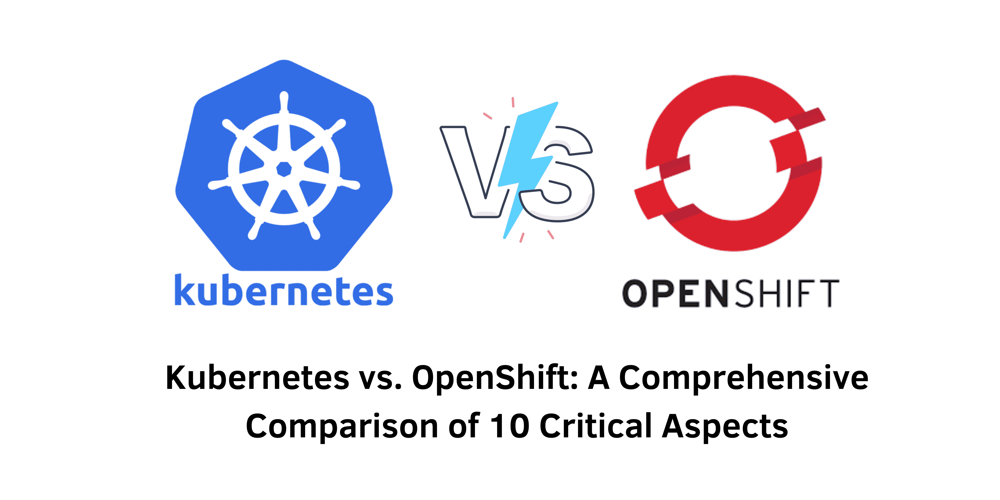

> An In-Depth Comparison of Kubernetes and OpenShift

## Introduction
In the rapidly evolving landscape of technology, effective container management has become essential for modern application development. Among the various options available, **Kubernetes** and **OpenShift** stand out as two of the most powerful container orchestration platforms. Both tools offer robust features, excellent performance, and extensive management capabilities. This article explores their functionalities, differences, and use cases to help you determine which solution best meets your containerized application needs.

&nbsp;

### What Is Kubernetes?
Kubernetes, commonly referred to as K8s, is an open-source platform designed for automating the deployment, scaling, and management of containerized applications. Initially developed by Google, it is now maintained by the Cloud Native Computing Foundation (CNCF). Kubernetes has emerged as the leading tool for container orchestration, particularly in cloud-native environments.

#### Key Features and Benefits of Kubernetes
- **Container Orchestration**: Kubernetes efficiently manages the scheduling and deployment of containers across a cluster, ensuring that applications run consistently.
- **Autoscaling**: It automatically scales applications based on predefined metrics such as CPU usage or custom metrics, optimizing resource utilization effectively.
- **Service Discovery and Load Balancing**: Kubernetes includes mechanisms for service discovery and built-in load balancing to distribute incoming traffic across application instances.
- **Self-Healing**: Continuously monitors the health of application components, automatically restarting or replacing failed containers, enhancing system reliability.
- **Declarative Configuration**: Users can define the desired state of applications using declarative configuration files, simplifying management and ensuring deployment consistency.
- **Extensibility**: A rich ecosystem of plugins, extensions, and APIs enables users to customize and extend the platform to meet specific needs, facilitating integration with third-party tools.

&nbsp;

### What Is OpenShift?
OpenShift is a container platform developed by Red Hat, built on Kubernetes, and designed to simplify the development, deployment, and management of containerized applications. OpenShift offers additional features and tools, providing a more integrated and user-friendly experience for developers, operators, and administrators.

#### Key Features and Benefits of OpenShift
- **Integrated CI/CD Pipelines**: OpenShift comes with built-in continuous integration and continuous delivery (CI/CD) pipelines, automating the processes of building, testing, and deploying applications.
- **Developer-Friendly Workflows**: Offers an intuitive web console and developer tools that simplify application management, allowing developers to focus on coding rather than infrastructure concerns.
- **Enhanced Security**: Incorporates robust security measures such as role-based access control (RBAC), network policies, and image scanning to ensure the confidentiality and integrity of applications.
- **Enterprise Support**: Backed by Red Hat’s extensive support network, providing enterprise-grade support, training, and consulting services.

&nbsp;

### Kubernetes vs. OpenShift: Feature Comparison
While both platforms share common roots in container orchestration, they differ significantly in functionality, ease of use, and enterprise capabilities.

#### Core Features

| Feature                       | Kubernetes                               | OpenShift                              |
|-------------------------------|-----------------------------------------|----------------------------------------|
| Container orchestration        | Yes                                     | Yes                                    |
| Autoscaling                   | Yes                                     | Yes                                    |
| Service discovery              | Yes                                     | Yes                                    |
| Self-healing                  | Yes                                     | Yes                                    |
| Integrated CI/CD pipelines     | No                                      | Yes                                    |
| Developer-friendly workflows    | No                                      | Yes                                    |
| Enhanced security              | Basic                                   | Advanced (RBAC, image scanning)       |
| Enterprise support             | Community-driven                        | Red Hat-backed                         |

&nbsp;

### Deployment and Management
Kubernetes requires users to manually configure various aspects of deployment and management, including networking, storage, and security policies. It is primarily managed through the kubectl command-line interface (CLI), which provides detailed control over cluster operations but demands a deep understanding of Kubernetes concepts.

In contrast, OpenShift simplifies deployment and management through its intuitive web console, enabling users to deploy applications with just a few clicks. This ease of use makes OpenShift particularly appealing to organizations looking to reduce the complexity of managing containerized applications.

&nbsp;

### Scalability and Performance
Kubernetes offers flexible scaling options, allowing users to scale their applications both vertically (resizing individual pods) and horizontally (adding or removing pods) based on workload demands. It includes built-in load balancing to ensure optimal performance and high availability.

OpenShift is optimized for enterprise workloads, providing enhanced performance features such as optimized scheduling, resource quotas, and priority classes. It supports horizontal autoscaling based on metrics like CPU or memory utilization, making it well-suited for large-scale deployments.

&nbsp;

### Ecosystem and Community Support
Kubernetes boasts one of the largest and most active open-source communities, providing extensive resources, support, and collaboration opportunities. Its vast ecosystem includes tools for container runtimes, networking, storage solutions, CI/CD, and monitoring.

OpenShift benefits from its integration with the broader Red Hat ecosystem, offering seamless interoperability with other Red Hat products and services. This integration provides users with additional tools and support options to enhance their OpenShift deployments.

&nbsp;

### Kubernetes vs. OpenShift: Use Cases and Industry Adoption
Both Kubernetes and OpenShift are widely adopted across various industries, each serving unique use cases.

#### Common Use Cases for Kubernetes
- **Microservices Architecture**: Ideal for managing complex applications built using microservices, facilitating independent deployment and scaling.
- **Cloud-Native Applications**: Integrates seamlessly with various cloud platforms, enabling efficient management of cloud-native applications across hybrid or multi-cloud environments.
- **Machine Learning and AI**: Efficiently manages machine learning workloads, orchestrating training jobs and scaling resources as needed.
- **High-Performance Computing (HPC)**: Suitable for managing computationally intensive tasks in scientific research and engineering simulations.
- **Telecommunications**: Manages containerized network functions (CNFs) for 5G networks and edge computing.
- **Gaming Industry**: Helps manage game server clusters, providing low-latency experiences and scaling game instances according to player demand.

#### Common Use Cases for OpenShift
- **Continuous Integration and Delivery (CI/CD)**: Streamlines development workflows with built-in CI/CD capabilities.
- **Enterprise Containerization**: Benefits large organizations with its security features and enterprise-grade support.
- **DevOps Workflows**: Fosters collaboration among development teams, accelerating application delivery cycles.
- **Healthcare**: Manages containerized applications in healthcare, ensuring secure data handling.
- **Financial Services**: Supports containerized applications in banking, enhancing security and compliance.
- **Retail**: Enables retailers to deploy and manage applications for e-commerce, ensuring scalability during peak shopping seasons.

&nbsp;

### Conclusion
Choosing between Kubernetes and OpenShift depends on your specific needs and priorities. Kubernetes offers unparalleled flexibility and control, making it ideal for advanced users who desire a customizable solution. On the other hand, OpenShift provides a user-friendly and secure platform, perfect for organizations seeking a more straightforward approach to deploying containerized applications.

Regardless of your choice, pairing either tool with a reliable data storage solution optimized for container environments is essential for ensuring persistent storage that meets the needs of both Kubernetes and OpenShift deployments.

#### References
- Kubernetes Documentation: [Kubernetes](https://kubernetes.io/docs/)
- OpenShift Documentation: [OpenShift](https://docs.openshift.com/)
- Cloud Native Computing Foundation: [CNCF](https://www.cncf.io/)