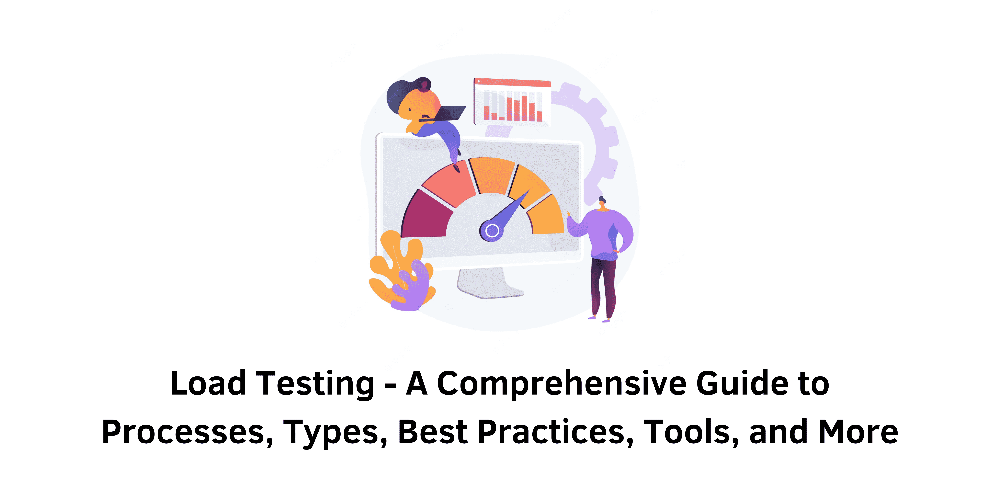

> Specification : Load Testing, Stress Testing

## Introduction:
Load testing is an essential part of software development to ensure applications can handle real-world demands. This comprehensive guide provides an in-depth understanding of load testing, including its definition, architecture, processes, types, best practices, and tools. By following these guidelines, you can effectively conduct load testing and deliver high-quality software that meets user expectations.

### 1. What is Load Testing?
Load testing is a type of performance testing that evaluates the performance of software applications under realistic load conditions. It helps determine if a system, software, or computing equipment can handle high loads and respond effectively to user demands.

### 2. Load Testing Architecture:
The load testing architecture involves multiple components such as users, firewalls, load balancers, web servers, application servers, and database servers. These components work together to handle user requests and simulate real-world load scenarios.

### 3. Process in Load Testing:
The load testing process consists of several steps:
- Setting up the test environment that closely resembles the production environment.
- Defining performance criteria and objectives to measure the application's performance.
- Creating virtual users and scenarios that simulate user interactions.
- Executing load test scenarios and monitoring system resources.
- Analyzing test results to identify performance bottlenecks and areas for improvement.

### 4. Best Practices for Load Testing:
To ensure effective load testing, it's important to follow best practices such as:
- Identifying business objectives and scope.
- Creating comprehensive test cases that cover positive and negative scenarios.
- Determining key metrics to measure application performance.
- Understanding the test environment and its configurations.
- Selecting the appropriate load testing tool based on your needs.
- Running tests incrementally to avoid system failures.
- Prioritizing customer satisfaction as a critical goal.

### 5. Types of Load Testing:
Load testing can be performed using different methodologies:
- Manual Load Testing: Conducted manually, but lacks reproducibility and precise stress levels.
- In-house Load Testing Tools: Developed internally by organizations.
- Open-source Load Testing Tools: Free tools with varying levels of sophistication.
- Enterprise-level Load Testing Tools: Commercial tools with advanced features for simulating large user loads.

### 6. How to Select a Load Testing Tool?
Choosing the right load testing tool is crucial for successful testing. Consider the following aspects while evaluating tools:
- Ease of creating complex and realistic load tests.
- Accuracy and compatibility with real browsers.
- Scalability to accommodate different usage scenarios.
- Integration capabilities with other tools and systems.

### 7. Recommended Load Testing Tools:
Several licensed load testing tools are available in the market, including:
- LoadNinja
- LoadFocus
- WebLOAD
- WAPT
- CloudTest
- LoadImpact
- Parasoft Load Test
- BlazeMeter
- Eggplant

### 8. Benefits of Load Testing:
Load testing offers various benefits, such as:
- Lowering failure costs by identifying issues early in the development cycle.
- Determining an application's capacity limits for scalability planning.
- Identifying bottlenecks before deployment to prevent costly issues.
- Reducing system downtime by proactively addressing potential failures.
- Improving customer satisfaction through optimal response times.

### 9. Load Testing vs. Stress Testing:
Load testing focuses on evaluating an application's performance under normal demand, while stress testing pushes the system to its limits and assesses its behavior under extreme conditions. Both approaches are useful in assessing system performance and identifying potential weaknesses.

### 10. Importance of Load Testing:
Load testing is crucial for ensuring that applications can handle user demands and perform effectively under real-world conditions. It helps identify and fix errors, ensures optimal performance, and saves costs associated with production failures.

&nbsp;

## Conclusion:
Load testing is an integral part of software testing that ensures applications can handle realistic user loads. By following the processes, best practices, and using appropriate tools, you can conduct effective load testing and deliver high-quality software that meets user expectations. Regular load testing throughout the development cycle is recommended to ensure optimal performance and customer satisfaction.

&nbsp;
#### Reference:
- atatus : https://www.atatus.com/blog/what-is-load-testing/
