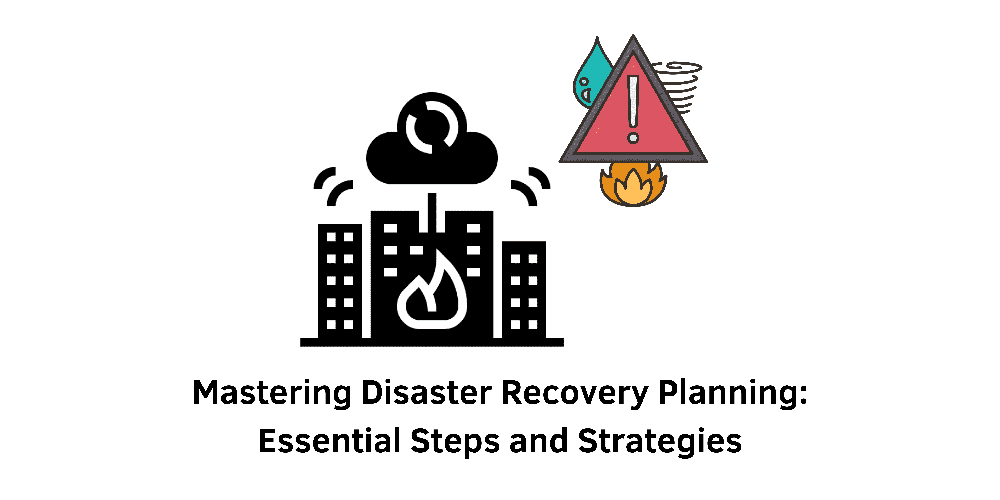

> Are you looking to develop a robust disaster recovery plan that ensures your business can effectively respond to unexpected events? This article will guide you through the essential steps and strategies for creating a comprehensive disaster recovery plan that minimizes downtime and maintains business continuity.

## Introduction
A disaster recovery plan (DRP) is a vital document that outlines the strategies and processes to follow during a disaster, aimed at ensuring the continuity of business operations. The primary goal of a DRP is to minimize disruption and facilitate a swift return to normalcy. In this article, we will explore the essential components and steps necessary for crafting an effective disaster recovery plan, empowering your business to remain resilient in the face of unforeseen challenges.

&nbsp;

## What Is a Disaster Recovery Plan?

A disaster recovery plan is a structured strategy that details the actions to be taken when a disaster occurs. This plan is crucial for minimizing downtime and ensuring that business functions can continue or resume as quickly as possible. The key elements of a DRP include:

- **Documented Procedures**: Comprehensive yet flexible guidelines designed to handle the unpredictability of disasters.
- **Crisis Management**: The plan is tailored to manage significant crises that disrupt business operations.
- **Operational Continuity**: Focuses on maintaining and recovering essential business functions.

&nbsp;

## Key Components of a Disaster Recovery Plan

An effective disaster recovery plan comprises several interconnected components that work together to ensure maximum efficiency during a crisis:

### 1. Risk Assessment
Conducting a thorough risk assessment involves evaluating the importance of hardware, software, and business processes. It is vital to prioritize recovery efforts for the most critical elements that drive revenue and support core operations. This assessment helps identify potential threats and their possible impacts on the business.

### 2. Recovery Procedures
Having clear and detailed recovery procedures is essential for efficiently restoring business operations. These procedures should be well-documented, leaving no room for ambiguity. Each step must be actionable and tailored to ensure a smooth recovery process.

### 3. Backups
Reliable and secure backups are crucial for recovery. Without them, businesses may face significant losses while attempting to rebuild their environments. Regular testing of backups to ensure they are up-to-date and accessible is a key aspect of this component.

### 4. Communication Plans
A solid communication plan should include strategies and templates for internal teams, vendors, partners, and clients. Effective communication ensures that all stakeholders are informed and coordinated during a crisis.

### 5. Testing
Regular testing of the disaster recovery plan is vital to ensure that everyone understands their roles and to identify areas for improvement. Simulation exercises can help validate the effectiveness of the recovery procedures.

### 6. Maintenance
Ongoing maintenance of backups and critical recovery infrastructure is necessary to ensure their availability when needed. This includes updating the disaster recovery plan to reflect changes in the business environment or technology.

&nbsp;

## Creating a Disaster Recovery Plan

Developing a comprehensive disaster recovery plan involves several key steps:

### 1. Application Inventory
Start by identifying all applications and their roles in supporting business operations. This inventory should also include the types of data each application holds. Understanding the significance of each application helps prioritize recovery efforts effectively.

### 2. Application Tiering
Determine the criticality of each application. Tier 0 applications are those that are essential for business functioning, such as core scheduling or payroll applications. Establishing tiers assists in organizing the recovery process efficiently.

### 3. Recovery Steps
Understand the specific steps required to recover each application. Involve technical teams to provide detailed recovery steps for each tiered application. Documenting these procedures ensures clarity and preparedness.

### 4. Communication Plans
Develop communication strategies and templates, typically managed by the communications or legal departments. Clear communication plans help prevent confusion and ensure that everyone is aware of their roles during a disaster.

### 5. Training
Ensure that all employees are familiar with the disaster recovery plan and understand their roles. Regular training sessions and drills reinforce this knowledge and prepare staff for potential crises.

&nbsp;

## Testing and Maintaining the Disaster Recovery Plan

Regular testing and maintenance are crucial for an effective disaster recovery plan. This process can be broken down into four key objectives:

### 1. Test the Plan
Conduct walkthroughs and simulations to ensure that everyone knows their responsibilities. Testing backups and recovering applications to a test environment can reveal valuable insights and highlight weaknesses in the plan.

### 2. Document the Tests
Recording the results of tests helps identify areas for improvement and supports data-driven decision-making. Detailed documentation of tests provides a reference for future enhancements.

### 3. Update the Plan
Incorporate the findings from tests into the disaster recovery plan for continuous improvement. Regular reviews ensure that the plan remains relevant and effective in addressing the business's current needs.

### 4. Involve the Business
Engage business partners in the testing process to foster accountability and align with business objectives. Collaboration with different departments ensures a holistic approach to disaster recovery.

&nbsp;

## Implementing the Disaster Recovery Plan

When a disaster occurs, implementing the disaster recovery plan involves several critical steps:

### 1. Activate the Plan
Formally declare a disaster and invoke the plan to ensure alignment and focus on recovery efforts. Clear communication about the activation is essential for a coordinated response.

### 2. Follow Recovery Processes
Adhere to predefined recovery steps, making adjustments as necessary to address unforeseen challenges. Flexibility in the plan allows for effective handling of unexpected issues.

### 3. Communicate Effectively
Follow communication plans to keep all stakeholders informed and ensure coordinated efforts. Regular updates during the recovery process help manage expectations and reduce uncertainty.

### 4. Monitor Progress
Continuously monitor the recovery process and make adjustments as needed. Tracking progress ensures that recovery efforts stay on course and meet desired objectives.

### 5. Review and Improve
After completing the recovery process, conduct a review to identify areas for improvement. This post-mortem analysis helps refine the disaster recovery plan for future incidents.

&nbsp;

## Conclusion

Developing and implementing a disaster recovery plan is essential for any organization. By understanding the key components, following a structured approach, and regularly testing and updating the plan, businesses can ensure they are prepared to handle crises effectively. This proactive strategy not only minimizes downtime and losses but also ensures business continuity in the face of unexpected disasters. A well-prepared disaster recovery plan is a cornerstone of business resilience, providing a roadmap to navigate through challenging times and emerge stronger.

#### References
- FEMA: [Disaster Recovery Planning](https://www.fema.gov)
- NIST: [Guide to Business Continuity Planning](https://nvlpubs.nist.gov/nistpubs/SpecialPublications/NIST.SP.800-34r1.pdf)
- ITIL: [Service Continuity Management](https://www.axelos.com/)