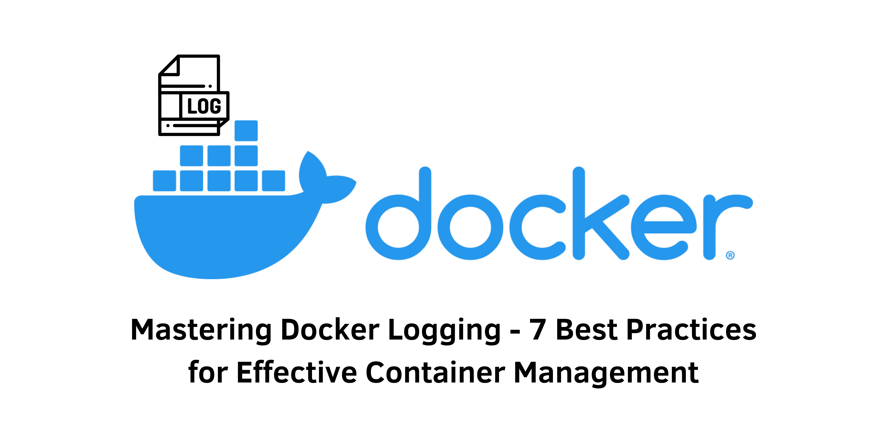

> Specification : Docker, Microservices, Logging, Cloud Computing

## Introduction:
Docker logging plays a crucial role in managing containers and ensuring smooth operation in a production environment. In this comprehensive guide, we will explore the best practices for Docker logging, enabling you to effectively track, troubleshoot, and optimize your applications. From configuring logging methods to managing log storage, these practices will help you overcome the challenges and streamline your Docker setup.

### 1. Configure Logging to the Standard Output Stream

Logging to the standard output stream provides accessibility and consistency in managing Docker containers. This practice allows you to collect logs efficiently, ensures availability in case of container failure, and simplifies log monitoring by storing logs in a standardized location. Discover how to leverage this method effectively for simple log output and transient log data.

### 2. Limit Log Size

To prevent performance issues and facilitate log analysis, it is essential to limit the log size of Docker containers. Learn why setting a reasonable log size limit, such as 10 MB per container, is crucial. By managing the log size, you can effectively utilize disk space, maintain system performance, and prevent storage overload.

### 3. Rotate Logs

Regular log rotation is necessary to maintain optimal system performance and data security. Discover how to implement log rotation tools like logrotate to archive or delete old logs while retaining the most recent ones. This practice prevents disk space exhaustion, enhances stability, and reduces the risk of data breaches.

### 4. Leverage a Centralized Logging Solution

Managing multiple Docker containers across different hosts requires aggregating log data in a central location. Explore the benefits of using a centralized logging solution, such as ELK (Elasticsearch, Logstash, and Kibana) or Graylog. Centralized logging simplifies log management, enables efficient analysis, and enhances troubleshooting capabilities.

### 5. Tag Log Messages

Tagging log messages with relevant information, including container name, hostname, and timestamps, improves log traceability and facilitates debugging. Discover how proper log tagging enhances log analysis efficiency, enables log categorization, and helps identify specific log messages related to containers or applications.

### 6. Monitor Logs

Regular log monitoring is essential for detecting and resolving issues promptly. Learn how automated log monitoring tools like Sentry, Datadog, and Logwatch can provide valuable insights into application performance. By implementing log monitoring, you can proactively identify and address problems, ensure data security, and track important business KPIs.

### 7. Store Logs for Compliance and Analysis

Storing logs for an adequate period is crucial for compliance, auditing, and troubleshooting purposes. Understand the significance of retaining log data and how it facilitates historical analysis, trend identification, and issue resolution. Consider the retention period based on your organization's requirements and consult legal advisors for compliance guidelines.

&nbsp;

## Conclusion:
Mastering Docker logging is key to effective container management. By implementing these best practices, you can optimize your Docker environment, overcome logging challenges, and ensure the smooth operation of your containers. Explore the benefits of proper Docker logging configuration, log size management, log rotation, centralized logging, log tagging, log monitoring, and log storage. Start applying these practices today to enhance application security, troubleshooting capabilities, and overall Docker performance.

&nbsp;
#### Reference:
- semaphore : https://semaphoreci.com/blog/docker-logging-best-practices
