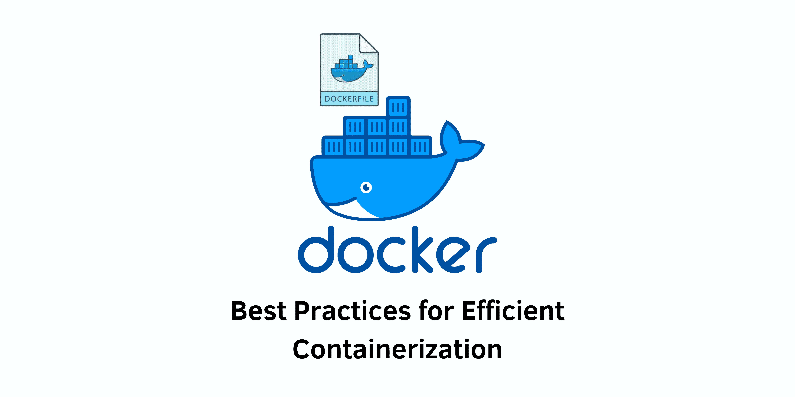

> Specification : Docker, Dockerfile, Containerization



## Introduction:
Docker is a popular platform for containerization that allows developers to package their applications and dependencies into lightweight, portable containers. Writing efficient Dockerfiles is crucial to optimize container performance, reduce image size, and improve overall development and deployment workflows. In this blog post, we will explore 13 tips to enhance your Dockerfile writing skills and create efficient Docker images.

### 1. Start with a small base image:
Utilize Alpine Linux or other minimal base images to reduce the size of your Docker image and include only the necessary binaries and libraries.
#### Example :
```
FROM node:16.20.0 image size ~ 332.68 MB
FROM node:16.20.0-alpine image size ~ 40.4MB
```

### 2. Create multi-line arguments:
Combine multiple RUN commands into a single command using the backslash character to minimize the number of intermediate image layers.
#### Example :
```
RUN apt-get update
RUN apt-get -y install nginx
RUN apt-get -y install wget
RUN apt-get -y install nano
```
This above command can be written in the structured way to reduce the number of layers.

```
RUN apt-get update \
    && apt-get -y install nginx \
    && apt-get -y install wget \
    && apt-get -y install nano
```

### 3. Minimize the number of layers:
Consolidate instructions and compress multiple RUN commands together using the Bash && operator to reduce the number of layers in your Docker image.

### 4. Leverage the build cache:
Docker caches intermediate layers, so order your instructions from least to most frequently changing content to maximize cache utilization and speed up build times.

### 5. Order steps by changing content frequency:
Place the most frequently changing steps at the end of your Dockerfile to take advantage of the build cache for unchanged layers during iterative development and faster rebuilds.
#### Example :
```
FROM debian
COPY . /app
RUN apt-get update\
    && apt-get -y install openjdk-8
CMD [“java”, “-jar”, “/app/app.jar”]
```
You can write above dockefile as

```
FROM debian
RUN apt-get update\
    && apt-get -y install openjdk-8
COPY . /app
CMD [“java”, “-jar”, “/app/app.jar”]
```

### 6. Prefer COPY over ADD:
Use the COPY instruction instead of ADD when copying files into your container to avoid unnecessary unpacking and potential security risks.
#### Example :
```
ADD /foo.tar.gz /tmp/
```

### 7. Install only what you need:
Avoid installing extra or unnecessary packages to minimize image complexity, dependencies, file sizes, and build times. Use the "--no-install-recommends" option when installing packages.

### 8. Use specific tags for official images:
Instead of relying on the "latest" tag, use specific tags for official images to ensure consistency and avoid unexpected changes in your Docker image.
#### Example :
```
FROM ubuntu
COPY . /app
RUN apt-get update\
    && apt-get -y install openjdk-8
CMD [“java”, “-jar”, “/app/app.jar”]
```
Instead use this image

```
FROM ubuntu
RUN apt-get update\
    && apt-get -y install openjdk-8
COPY . /app
CMD [“java”, “-jar”, “/app/app.jar”]
```

### 9. Avoid storing sensitive information in Dockerfiles:
Do not include secret or sensitive information directly in Dockerfiles, as images can be accessed by others, compromising security. Utilize environment variables or secret management solutions.

### 10. Avoid installing SSH or similar services:
Minimize potential security vulnerabilities by excluding SSH or other services that may expose unnecessary open ports in your container.

### 11. Utilize .dockerignore file:
Create a .dockerignore file to exclude unnecessary files and directories from the build context, improving build speed and reducing the size of the Docker image.

### 12. Utilize multi-stage builds:
Leverage multi-stage builds to reduce the final image size by separating build dependencies from the runtime environment. This allows you to discard unnecessary build artifacts and libraries.
#### Example :
```
# Stage 1: Build the application
FROM maven:3.8.4-openjdk-11 AS builder
WORKDIR /app
COPY pom.xml .
COPY src ./src
RUN mvn clean package

# Stage 2: Create the final lightweight image
FROM adoptopenjdk:11-jre-hotspot
WORKDIR /app
COPY --from=builder /app/target/app.jar .
CMD ["java", "-jar", "app.jar"]
```

### 13. Run containers as non-root user:
Enhance container security by running your application as a non-root user, creating a dedicated user inside the container and setting appropriate file system permissions.
#### Example :
```
FROM alpine:3.12 as builder
WORKDIR /build
COPY . .
RUN apk update && \
    apk add --no-cache build-base && \
    gcc -o myapp main.c

FROM alpine:3.12
RUN adduser -D myuser
WORKDIR /app
COPY --from=builder /build/myapp .
RUN chown myuser:myuser myapp
USER myuser
ENTRYPOINT ["./myapp"]
```
---

## Conclusion:
By following these 13 tips, you can optimize your Dockerfile writing and containerization process, leading to more efficient Docker images, improved performance, reduced image size, enhanced security, and streamlined development and deployment workflows. Incorporating these best practices will help you maximize the benefits of Docker and containerization in your projects.

Remember, writing efficient Dockerfiles is an iterative process, and you can adapt these tips based on your specific use cases and requirements. Happy containerizing!

---
#### Reference 
- Medium : @praveensirvi