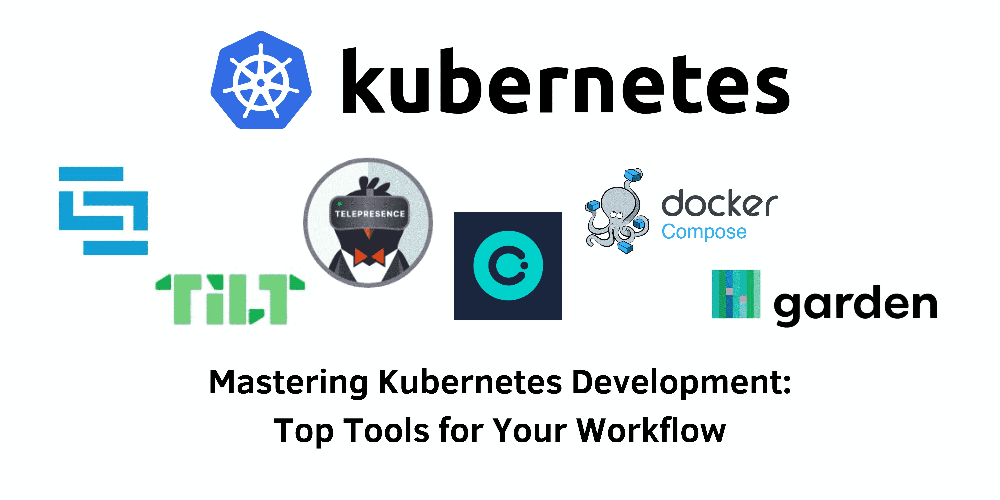

> Specification: Kubernetes, Development Tools



## Introduction:
In the ever-evolving landscape of software development, Kubernetes has emerged as a pivotal platform for managing containerized applications. To maximize efficiency and productivity, developers need robust tools that can simplify and enhance their Kubernetes development process. This blog delves into six essential Kubernetes development tools, highlighting their features, benefits, and limitations, to help you choose the best tools for your workflow.

&nbsp;
### Skaffold
**Skaffold** automates the development workflow for Kubernetes applications. It supports continuous development by automating image builds, deployments, and monitoring changes in the source code.

**Configuration Example:**
```yaml
apiVersion: skaffold/v2beta15
kind: Config

build:
  artifacts:
    - image: my-app
      context: ./app
      docker:
        dockerfile: Dockerfile

deploy:
  kubectl:
    manifests:
      - k8s/deployment.yaml
      - k8s/service.yaml
```

**Benefits:**
- Modular architecture, integrating various tools.
- Supports multiple build tools.
- Google’s Cloud Code plugin for seamless local and remote development.
- Maintains distinct configurations for different environments using profiles.

**Limitations:**
- Handling numerous resource-intensive microservices locally can be challenging.
- Mocking certain services might deviate from actual production behavior.

&nbsp;
### Tilt
**Tilt** enhances the Kubernetes developer experience by offering a configuration file (Tiltfile) that defines how your application should be built, deployed, and managed during development.

**Configuration Example:**
```python
docker_build(
    './app',
    dockerfile='Dockerfile',
    image='my-app'
)

k8s_yaml('k8s/deployment.yaml')
k8s_yaml('k8s/service.yaml')
```

**Benefits:**
- User-friendly UI for monitoring service health, build progress, and logs.
- Excellent overview of running services via a web UI.

**Limitations:**
- Requires additional learning, especially for those unfamiliar with Starlark.
- Tiltfile’s language might lack flexibility compared to YAML.

&nbsp;
### Telepresence
**Telepresence** allows you to run a single service locally while connecting it to a remote Kubernetes cluster, eliminating the need for continuous publishing and deployment of new artifacts.

**Usage Example:**
1. Connect your local development environment to the remote cluster:
   ```bash
   telepresence connect
   ```
2. Intercept traffic to a local service:
   ```bash
   telepresence intercept order-service --port 8080
   ```

**Benefits:**
- Facilitates remote development with minimal resource usage.
- Ideal for working with distributed systems and microservices architectures.

**Limitations:**
- Relies on the availability and connectivity of the remote Kubernetes cluster.
- May require extra setup in environments with strict network or firewall restrictions.

&nbsp;
### Okteto
**Okteto** shifts the inner development loop to the cluster, defining the development environment in a `okteto.yaml` manifest file.

**Configuration Example:**
```yaml
environment:
  name: my-dev-env
  namespace: my-namespace
  image: my-app:latest

sync:
  - local_path: ./app
    remote_path: /app

port_forwarding:
  - service: my-app
    local_port: 8080
    remote_port: 80
```

**Benefits:**
- Effortless file synchronization between local and remote Kubernetes clusters.
- Exceptional hot code reload functionality and bi-directional port forwarding.

**Limitations:**
- Heavy reliance on a remote Kubernetes cluster can disrupt the development workflow if there are connectivity issues.
- Increased resource consumption and potential cost implications.

&nbsp;
### Docker Compose
**Docker Compose** is widely used for defining and running multi-container applications. With Docker's Kubernetes integration, Compose files can deploy applications to a Kubernetes cluster.

**Configuration Example:**
```yaml
version: '3'

services:
  app:
    build:
      context: .
      dockerfile: Dockerfile
    ports:
      - "8080:8080"
    volumes:
      - ./src/main/resources:/app/config
```

**Benefits:**
- Simplifies the setup of complex development environments.
- Adheres to the KISS principle, making it accessible to developers new to container orchestration.

**Limitations:**
- Differences between Docker Compose setups and actual Kubernetes environments can complicate debugging.
- Primarily suited for single-host applications, making it less ideal for production Kubernetes clusters.

&nbsp;
### Garden
**Garden** provides a consistent and reproducible local development environment for Kubernetes, integrating well with popular IDEs and offering features like hot reloading and seamless service discovery.

**Configuration Example:**
```yaml
services:
  web:
    build: .
    ports:
      - target: 3000
        published: 3000
        protocol: tcp
```

**Benefits:**
- Streamlines the setup process for cloud-native development environments.
- Simplifies Kubernetes configuration and deployment-related tasks.

**Limitations:**
- Intricate setup with a steeper learning curve compared to other tools.
- Some features are commercial, requiring payment for full access.

&nbsp;
## Conclusion:
Choosing the right local development tool for Kubernetes can significantly impact your productivity and the quality of your applications. Each tool discussed has its strengths and weaknesses, catering to different use cases and preferences. Skaffold and Tilt excel in automation and iterative development, Telepresence and Okteto provide seamless interaction with remote clusters, Docker Compose offers a familiar experience with multi-container applications, and Garden provides a comprehensive development environment. Evaluate your specific requirements and workflows to find the tool that best suits your needs and enhances your Kubernetes development experience.

#### References:
- semaphore: [Simplifying Kubernetes Development: Your Go-To Tools Guide](https://semaphoreci.com/blog/kubernetes-development-tools)