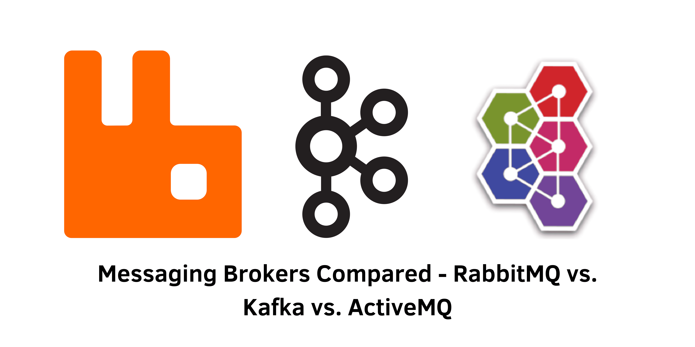

> Specification : Message Broker, RabbitMQ, Kafka, ActiveMQ

## Introduction:
In today's distributed software ecosystem, messaging brokers play a crucial role in managing communication between services. RabbitMQ, Kafka, and ActiveMQ are three popular messaging brokers with distinct features and use cases. This article provides a comprehensive comparison of these brokers, helping you make an informed decision for your project.

- **RabbitMQ:**
RabbitMQ is an open-source message broker that implements the Advanced Message Queuing Protocol (AMQP). Built for high-throughput, low-latency messaging, RabbitMQ offers key features such as wide language support, flexible routing, and clustering for high availability.

- **Kafka:**
Apache Kafka, originally designed by LinkedIn, is a distributed streaming platform that serves as a message broker. Kafka's strengths lie in high-throughput, fault-tolerant, and scalable event streaming. It utilizes log-based storage, enables horizontal scalability, and offers built-in support for real-time stream processing through Kafka Streams.

- **ActiveMQ:**
Apache ActiveMQ is an open-source message broker that supports the Java Message Service (JMS) API. ActiveMQ focuses on high performance and reliability, catering to enterprise use cases. It provides support for multiple protocols, configurable persistence options, and advanced features like message prioritization and scheduling.

---

## Comparison of Key Features:
This section highlights the key differences among RabbitMQ, Kafka, and ActiveMQ:

**1. Performance and Scalability:**
   - Kafka excels in high throughput and horizontal scalability, making it ideal for handling large data volumes.
   - RabbitMQ and ActiveMQ offer high performance, but Kafka generally outperforms them, especially in scenarios with high data volume.

**2. Message Ordering and Priority:**
   - RabbitMQ and ActiveMQ guarantee message ordering within a single queue or topic, respectively.
   - Kafka ensures message ordering within a partition but not across partitions within a topic.
   - RabbitMQ and ActiveMQ support message prioritization, while Kafka lacks built-in message priority support.

**3. Message Model and Durability:**
   - RabbitMQ follows a queue-based message model using AMQP, Kafka utilizes a distributed log-based model, and ActiveMQ uses JMS and a queue-based model.
   - All three brokers support durable messaging, but the mechanisms for achieving durability differ.

**4. Message Routing and Replication:**
   - RabbitMQ provides advanced message routing through exchanges and bindings.
   - ActiveMQ utilizes selectors and topics for more advanced routing, while Kafka relies on topic-based partitioning.
   - RabbitMQ and Kafka have their replication mechanisms, whereas ActiveMQ uses Master-Slave replication.

**5. Stream Processing:**
   - Kafka offers native stream processing capabilities through Kafka Streams.
   - RabbitMQ also supports stream processing, while ActiveMQ relies on third-party libraries.

**6. Latency and License:**
   - RabbitMQ is designed for low-latency messaging.
   - RabbitMQ is licensed under the Mozilla Public License, while Kafka and ActiveMQ are licensed under the Apache 2.0 License.

&nbsp;

## Conclusion:
When choosing a messaging broker, consider your project's requirements and the strengths of each option. RabbitMQ is suitable for low-latency messaging and flexible routing, Kafka excels in high-throughput and real-time stream processing, and ActiveMQ provides versatility with multiple protocols and enterprise features. Understanding the differences between RabbitMQ, Kafka, and ActiveMQ will empower you to select the ideal messaging broker for your project's needs.

&nbsp;
#### Reference:
- Design Gurus : https://www.designgurus.io/blog/RabbitMQ-Kafka-ActiveMQ-System-Design
