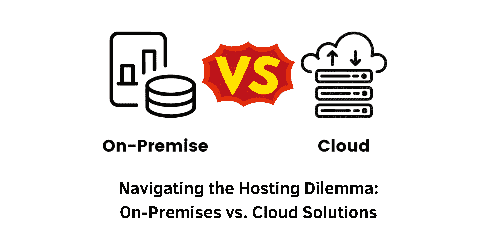

> In the rapidly evolving digital landscape, businesses face the critical task of deciding where to host their IT infrastructure. This article provides an in-depth look at on-premises and cloud hosting solutions, exploring their key differences and helping you choose the best option for your organization.

## Introduction

As businesses increasingly rely on technology for operations, the choice of hosting infrastructure becomes paramount. Organizations can either host resources "on-premises" in their own physical data centers or utilize cloud service providers through a subscription model. This decision is influenced by various factors, including cost, security, scalability, and compliance requirements. In this article, we will explore the key distinctions between on-premises and cloud hosting and offer insights to guide your selection process.

&nbsp;

## What Is Cloud Hosting?

Cloud hosting leverages third-party data centers to provide computing resources such as storage, applications, processing, and virtualization. These resources are accessed over the public internet, delivering several significant benefits:

### Key Benefits of Cloud Hosting

1. **Scalability**: Cloud hosting allows organizations to scale resources quickly and efficiently. Businesses can adjust their usage based on demand, paying only for what they consume. This flexibility is particularly valuable for handling fluctuating workloads and supporting rapid growth without heavy upfront investments.

2. **Agility**: The cloud enables rapid deployment of services, allowing organizations to respond swiftly to market changes and opportunities. This agility fosters innovation and reduces the time-to-market for new applications and services.

3. **Cost Efficiency**: Generally, cloud hosting requires a lower initial investment than building and maintaining physical data centers. This model allows organizations to expand resources as needed without incurring significant capital expenses.

4. **Disaster Recovery**: Many cloud providers offer built-in disaster recovery solutions, ensuring data redundancy and enhancing business continuity without the need for separate infrastructure.

&nbsp;

## What Is On-Premises Hosting?

On-premises hosting refers to maintaining computing resources within a data center that the organization builds and manages itself. Connectivity can be established through private networks for local users and the public internet for remote access.

### Key Benefits of On-Premises Hosting

1. **Control**: On-premises hosting provides organizations with greater control over their infrastructure, enabling custom configurations and specific security measures tailored to meet unique requirements.

2. **Security**: An on-premises deployment can enhance security by isolating resources from the public internet, theoretically reducing exposure to external threats.

3. **Compliance**: For organizations governed by strict data protection regulations, on-premises hosting can facilitate compliance with legal and regulatory standards, particularly concerning data sovereignty.

4. **Performance**: Hosting data locally can lead to reduced latency and improved performance for applications requiring high-speed access.

&nbsp;

## Hybrid and Private Cloud Solutions

### Hybrid Cloud

A hybrid cloud combines both cloud and on-premises deployments, allowing for a unified management and orchestration platform. This approach leverages the benefits of both environments, enabling organizations to optimize their infrastructure according to specific needs while maintaining flexibility.

### Private Cloud

A private cloud is a dedicated cloud environment hosted within an organization’s premises or a dedicated environment provided by a vendor. It offers similar benefits to public clouds, such as centralized data management and streamlined applications, but with greater control and security.

&nbsp;

## Factors to Consider When Choosing Between On-Premises and Cloud Hosting

### Agility

Cloud hosting typically offers more agility, allowing for rapid scaling of resources and a pay-as-you-go model. However, some organizations may find that on-premises solutions provide the specific agility needed for unique development requirements.

### Resilience

Established cloud providers often maintain high standards for reliability and uptime, equipped with robust incident response processes. However, if a widespread security incident affects all customers, the resilience of cloud hosting may be compromised.

### Cost Management

Cloud solutions generally offer lower initial costs and flexible scaling options, but fluctuating expenses can complicate budgeting. On-premises hosting may entail higher upfront costs but can offer more predictable ongoing expenses, appealing to organizations that prefer stable IT budgets.

### Evolving Technologies

Cloud providers frequently integrate the latest technologies, making advancements accessible to customers. Conversely, organizations relying on on-premises infrastructure must allocate resources to keep their technology current.

### Purpose-built Hardware

Organizations utilizing specialized hardware may find it challenging to replicate that infrastructure in a cloud environment. On-premises setups allow for tailored deployments to accommodate specific requirements.

### IT Management

Cloud providers aim to simplify IT management through user-friendly tools and interfaces. However, on-premises environments can afford organizations more direct control over their infrastructure, ensuring continuous availability.

### Staffing

IT staffing can pose challenges, particularly for on-premises environments requiring specialized personnel. Cloud services can alleviate some staffing concerns by reducing the need for in-house expertise.

### Compliance

Data governance and integrity regulations may dictate whether organizations can utilize cloud solutions. In certain cases, strict compliance requirements may necessitate on-premises hosting.

### Computing Performance

Local private networks connected to on-premises data centers can deliver superior performance compared to cloud solutions that depend on shared resources and public internet bandwidth.

### Security

Both cloud and on-premises hosting solutions have distinct security advantages. While on-premises setups may provide enhanced security through isolation, cloud providers often maintain rigorous security standards that can be challenging to replicate in-house.

&nbsp;

## Conclusion

The choice between cloud and on-premises hosting is not merely an either/or decision. Many organizations find that a hybrid approach, leveraging both private and public cloud solutions, best meets their complex needs. Public cloud instances may span multiple providers, allowing for the flexibility to adopt a hybrid or multi-cloud environment tailored to specific organizational requirements. By thoroughly assessing the factors discussed, businesses can make informed decisions that align with their long-term strategic goals.

#### References

- **Gartner**. (2023). "Cloud Adoption Trends: A Survey of Enterprise Cloud Usage."
- **Forrester**. (2024). "The Future of On-Premises Infrastructure in the Cloud Era."
- **NIST**. (2023). "Guide to Cloud Computing Security."
- **IBM**. (2024). "On-Premises vs. Cloud: Choosing the Right Infrastructure for Your Business."
- **AWS**. (2024). "Best Practices for Cloud Security and Compliance."

By staying informed about the latest trends and best practices in hosting solutions, businesses can navigate the complexities of IT infrastructure management more effectively.