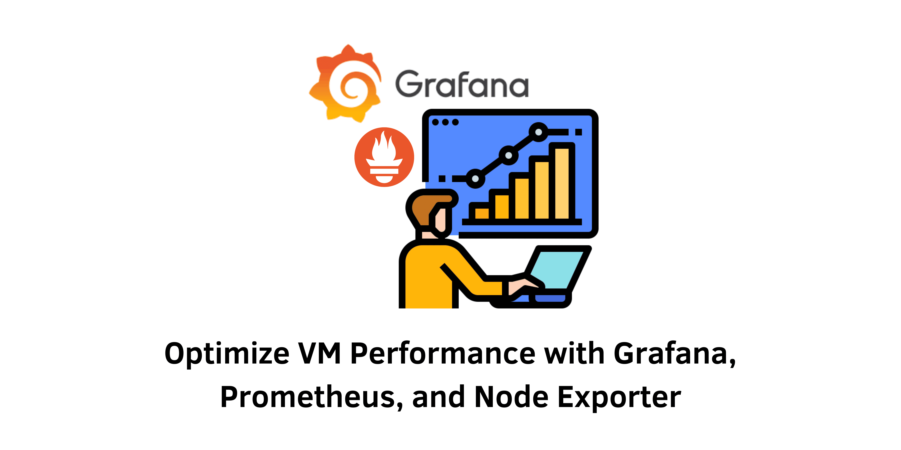

> Specification : Monitoring, Grafana, Prometheus, Node Exporter



## Introduction :
Maximizing the performance of virtual machines (VMs) is crucial for maintaining efficient and reliable systems. By utilizing the powerful combination of Grafana, Prometheus, and Node Exporter, you can effectively monitor and optimize VM stats. Grafana provides intuitive visualizations and dashboards, Prometheus enables real-time data collection, and Node Exporter collects essential system metrics. This integrated solution empowers you to identify bottlenecks, fine-tune resource allocation, and enhance overall VM performance. Discover how this dynamic trio can revolutionize your VM monitoring and boost your system's efficiency.

## Installation :

#### Create User
```
useradd --no-create-home --shell /bin/false prometheus
useradd --no-create-home --shell /bin/false node_exporter
```

#### Create folder Prometheus
```
mkdir /etc/prometheus
mkdir /var/lib/prometheus
```
#### Set User and Group Ownership folder
```
chown prometheus:prometheus /etc/prometheus
chown prometheus:prometheus /var/lib/prometheus
```
&nbsp;

### 1. Download Prometheus
To download Prometheus, you can visit the [Prometheus](https://github.com/prometheus/prometheus/releases/) releases page on GitHub. From there, you can select the desired version and download the corresponding release package.
```
wget https://github.com/prometheus/prometheus/releases/download/v2.44.0/prometheus-2.44.0.linux-amd64.tar.gz
tar -xzvf prometheus-2.44.0.linux-amd64.tar.gz
```
#### Copy folder prometheus and promtool
```
cp prometheus-2.44.0.linux-amd64/prometheus /usr/local/bin/
cp prometheus-2.44.0.linux-amd64/promtool /usr/local/bin/
```
#### Set User and Group Ownership folder
```
chown prometheus:prometheus /usr/local/bin/prometheus
chown prometheus:prometheus /usr/local/bin/promtool
```
#### Copy folder consoles and console_libraries
```
cp -R prometheus-2.44.0.linux-amd64/consoles /etc/prometheus/
cp -R prometheus-2.44.0.linux-amd64/console_libraries /etc/prometheus/
```
#### Set user and group ownership folder consoles and console_libraries
```
chown -R prometheus:prometheus /etc/prometheus/consoles
chown -R prometheus:prometheus /etc/prometheus/console_libraries
```
&nbsp;

### 2. Configure Prometheus
#### Create Configuration file for Prometheus
```
nano /etc/prometheus/prometheus.yml
```
and add file:
```
global:
  scrape_interval: 15s
scrape_configs:
  - job_name: 'prometheus'
    scrape_interval: 5s
    static_configs:
      - targets: ['192.168.13.11:17845'] 
```
Set user and group ownership prometheus.yml
```
chown prometheus:prometheus /etc/prometheus/prometheus.yml
```
&nbsp;

### 3. Prometheus Service
Create service for Prometheus
```
nano /etc/systemd/system/prometheus.service
```
and add file:
```
[Unit]
Description=Prometheus
Wants=network-online.target
After=network-online.target

[Service]
User=prometheus
Group=prometheus
Type=simple
ExecStart=/usr/local/bin/prometheus \
    --config.file /etc/prometheus/prometheus.yml \
    --storage.tsdb.path /var/lib/prometheus/ \
    --web.console.templates=/etc/prometheus/consoles \
    --web.console.libraries=/etc/prometheus/console_libraries \
    --web.listen-address=:17845

[Install]
WantedBy=multi-user.target
```
and activate prometheus service
```
systemctl daemon-reload
systemctl enable prometheus
systemctl start prometheus
systemctl status prometheus
```
&nbsp;

### 4. Download Node Exporter
To download Node Exporter, you can visit the [Node Exporter](https://github.com/prometheus/node_exporter/releases/) releases page on GitHub. From there, you can select the desired version and download the corresponding release package.

```
wget https://github.com/prometheus/node_exporter/releases/download/v1.6.0/node_exporter-1.6.0.linux-amd64.tar.gz
tar -xzvf node_exporter-1.6.0.linux-amd64.tar.gz
```
Copy node_exporter. Set user and group ownership node_exporter.
```
cp node_exporter-1.6.0.linux-amd64/node_exporter /usr/local/bin/
chown node_exporter:node_exporter /usr/local/bin/node_exporter
```
&nbsp;

### 5. Node Exporter Service
Create service for node_exporter
```
nano /etc/systemd/system/node_exporter.service
```
and add file:
```
[Unit]
Description=Node Exporter
Wants=network-online.target
After=network-online.target

[Service]
User=node_exporter
Group=node_exporter
Type=simple
ExecStart=/usr/local/bin/node_exporter --web.listen-address=:1322

[Install]
WantedBy=multi-user.target  
```
and activate node_exporter service
```
systemctl daemon-reload
systemctl enable node_exporter
systemctl start node_exporter
systemctl status node_exporter
```
&nbsp;

### 6. Prometheus Configuration for Node Exporter
Open prometheus.yml configuration file
```
nano /etc/prometheus/prometheus.yml
```
and add job for node_exporter
```
  - job_name: 'node_exporter'
    scrape_interval: 5s
    static_configs:
      - targets: ['192.168.13.11:1322'] 
```
and the final result prometheus.yml file
```
global:
  scrape_interval: 15s
scrape_configs:
  - job_name: 'prometheus'
    scrape_interval: 5s
    static_configs:
      - targets: ['192.168.13.11:17845']
  - job_name: 'node_exporter'
    scrape_interval: 5s
    static_configs:
      - targets: ['192.168.13.11:1322']
```
and then, restart prometheus
```
systemctl restart prometheus
systemctl status prometheus
```
&nbsp;

### 7. Add Node Exporter (Optional)
Prometheus can access metrics that are on other servers that have Node Exporter installed by adding the IP address in the prometheus.yml configuration.
```
global:
  scrape_interval: 15s
scrape_configs:
  - job_name: 'prometheus'
    scrape_interval: 5s
    static_configs:
      - targets: ['192.168.13.10:17845']
  - job_name: 'node_exporter'
    scrape_interval: 5s
    static_configs:
      - targets: ['192.168.13.11:1322', '192.168.13.12:1322']
```
#### Import Grafana Dashboard Node Exporter: 14731 and 11074