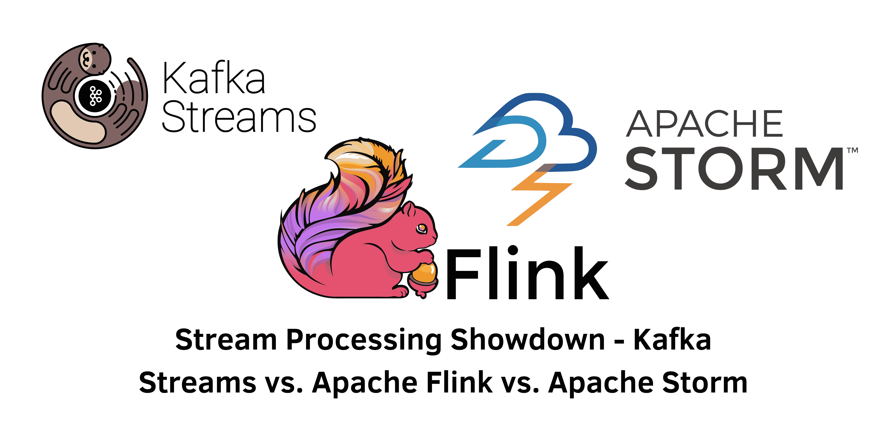

> Specification : Stream Processing, Kafka Streams, Apache Flink, Apache Storm

## Introduction:
In today's rapidly evolving landscape of big data, the ability to efficiently process and analyze real-time data streams is paramount for businesses seeking to derive immediate insights. Among the leading solutions in this space are Kafka Streams, Apache Flink, and Apache Storm—each offering distinct strengths, complexities, and nuances that impact their suitability for various use cases.

---
## Overview and Key Features:
### 1. Apache Kafka Streams:
**Description**: A client library facilitating application and microservice development where data resides in Kafka clusters, providing a seamless extension of Kafka's capabilities.

**- Pros:**
- Deep integration within Kafka ecosystem for simplified operations and reduced latency.
- Allows Java-based application development without a separate processing cluster.
- Offers exactly-once processing guarantee and supports stateful and stateless operations.

**- Cons:**
- Less feature-rich stream processing compared to some counterparts.
- Limited language support (Java-only) might restrict certain developers.
- Lacks native web-based UI or SQL interface.

&nbsp;
### 2. Apache Flink:
**Description:** An open-source framework for high-throughput, fault-tolerant, real-time analytics with robust support for event-time processing and out-of-order event handling.

**- Pros:**
- Powerful stream processing engine with rich features including windowing, transformations, and aggregations.
- Provides exactly-once processing semantics and a SQL interface, along with a web-based UI for visualization.
- Wide connector support for various storage systems and data sources.

**- Cons:**
- Setup complexity due to a separate processing cluster.
- Steeper learning curve compared to Kafka Streams.
- Higher resource consumption.

&nbsp;
### 3. Apache Storm:
**- Description:** A distributed real-time computation system known for its simplicity, language agnosticism, and suitability for processing high-velocity data.

**- Pros:**
- Low-latency real-time processing.
- Fault tolerance with at-least-once processing semantics.
- Supports multiple programming languages.

**- Cons:**
- Lacks native stateful operations, requiring manual implementation.
- Less graceful handling of event-time and out-of-order events compared to Flink.
- Complex, low-level API.

&nbsp;
## **Comparison Across Attributes:**

**(*) Processing Model:**
- Kafka Streams: Record-at-a-time processing model.
- Apache Flink: Record-at-a-time processing with robust event-time support.
- Apache Storm: Tuple-at-a-time processing model, similar to record-at-a-time.

**(*) State Management:**
- Kafka Streams: Local state stored on disk, replicated to Kafka for fault tolerance.
- Apache Flink: Managed, fault-tolerant local state with exactly-once guarantees.
- Apache Storm: Lacks native support; manual implementation needed.

**(*) Fault Tolerance:**
- All three offer fault tolerance with at-least-once processing semantics. Flink additionally supports exactly-once processing.

**(*) Time Handling:**
- Flink excels with robust support for event-time, processing-time, and ingestion-time semantics, along with watermark support. Kafka Streams supports both event-time and processing-time but struggles with out-of-order events. Storm primarily focuses on processing-time semantics.

**(*) Ease of Use:**
- Kafka Streams: Simple, especially within Kafka ecosystem.
- Flink: Richer feature set, clear APIs but steeper learning curve.
- Storm: Capable but with a higher learning curve due to lower-level abstractions.

**(*) Deployment:**
- Kafka Streams runs within the application, requiring less operational overhead. Flink and Storm run as separate clusters, needing more management.

## Conclusion:
Choosing between Kafka Streams, Apache Flink, and Apache Storm hinges on specific use case requirements. Kafka Streams excels in simplicity and Kafka integration, Flink offers powerful features for complex computations and event-time processing, while Storm suits high-velocity data processing needs.

Selecting the right stream processing system entails a deep understanding of your use case, operational constraints, and workload specifics. Armed with this comprehensive comparison, you can confidently navigate the stream processing landscape and choose the tool that best aligns with your needs, maximizing the value extracted from your data streams.

&nbsp;
#### Reference:
- Design Gurus : https://www.designgurus.io/blog/Kafka-Streams-%20Apache-Flink-Apache-Storm
