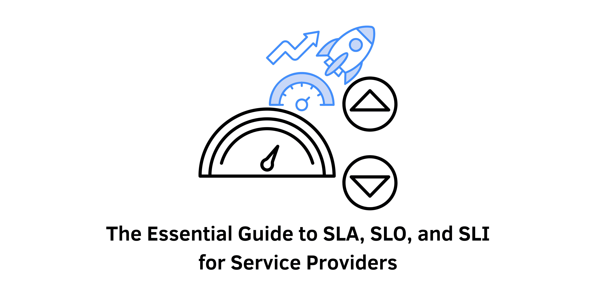

> In today’s digital environment, customers expect high levels of performance, availability, and usability from their service providers. To meet these expectations and ensure a positive user experience, providers establish SLAs, SLOs, and SLIs. This guide breaks down these critical concepts in site reliability engineering (SRE) and explains their importance.

## Introduction
Service Level Agreements (SLAs), Service Level Objectives (SLOs), and Service Level Indicators (SLIs) are fundamental to delivering quality service. Understanding how they interrelate helps service providers maintain high standards in performance and reliability. This article will clarify each component and discuss best practices for implementation, emphasizing their significance in enhancing customer satisfaction and trust.

### The Importance of SLAs, SLOs, and SLIs
In a competitive digital marketplace, the quality of service can significantly impact customer retention and satisfaction. SLAs, SLOs, and SLIs provide a structured approach to defining and measuring service quality, ensuring that service providers can meet or exceed customer expectations. These metrics not only guide operational teams but also foster transparency and accountability.

&nbsp;

## What Are Service Level Agreements (SLAs)?

### Definition
SLAs are formal contracts that define the minimum performance, availability, and other expectations between a service provider and its customers. They acknowledge that no service can be fully reliable or available, setting a foundation for trust and accountability.

### Key Components of SLAs
1. **Availability**: Specifies the operational time percentage of the service, commonly expressed as a percentage (e.g., 99.9% uptime).
2. **Response Time**: Indicates how quickly issues will be addressed, providing customers with confidence that their concerns will be managed promptly.
3. **Performance Guarantees**: Describes expected functionality and speed, aligning service expectations with actual performance.
4. **Consequences**: Outlines penalties for not meeting agreed standards, such as refunds or service extensions, thereby incentivizing compliance.

### Best Practices for SLAs
- **Involve Technical Teams**: Collaborate with IT and DevOps to ensure SLAs are realistic and achievable based on technical capabilities.
- **Reflect Customer Preferences**: Center SLAs around customer needs rather than internal metrics, focusing on what matters most to the user experience.
- **Use Clear Language**: Write SLAs in straightforward terms to prevent misunderstandings and ensure all parties are aligned.

&nbsp;

## What Are Service Level Objectives (SLOs)?

### Definition
SLOs are internal targets that providers aim to meet in order to fulfill SLAs. They outline specific standards for metrics like response time and system availability, serving as a roadmap for operational excellence.

### Key Components of SLOs
1. **Specificity**: Clearly defined goals that IT and DevOps teams can work towards, ensuring everyone is aligned on priorities.
2. **Buffer for Response**: Often set slightly higher than SLAs to allow for resolution time without breaching the SLA.
3. **Measurability**: Metrics that can be tracked and analyzed, enabling teams to assess their performance against set targets.

### Best Practices for SLOs
- **Simplicity and Clarity**: Ensure SLOs are easy to understand and achievable, preventing confusion and enhancing focus.
- **Account for Issues**: Prepare for unexpected delays or challenges, allowing for flexibility in achieving targets.
- **Focus on Essentials**: Prioritize critical metrics to avoid overwhelming teams with too many objectives, which can dilute efforts.

&nbsp;

## What Are Service Level Indicators (SLIs)?

### Definition
SLIs are the actual metrics that measure how effectively a provider is meeting its SLOs and SLAs. They gauge performance, availability, and other relevant factors, providing a real-time view of service quality.

### Key Components of SLIs
1. **Precision**: SLIs must be accurate and based on reliable data sources, ensuring that they reflect true performance.
2. **Measurability**: The methodology for measuring each SLI should be clear and explainable, allowing for consistent tracking.
3. **Relevance**: SLIs should directly impact the ability to meet SLAs and SLOs, focusing on metrics that matter most to customers.

### Best Practices for SLIs
- **Simplicity**: Focus on key metrics that directly influence service quality, avoiding unnecessary complexity.
- **Clarity**: Ensure measurement methodologies are transparent and easily understood, fostering trust in the reported metrics.

&nbsp;

## Why SLAs, SLOs, and SLIs Matter

### Enhancing Customer Trust
These frameworks help establish trust with customers by providing clear expectations and measurable standards. Customers appreciate transparency, knowing what to expect and how issues will be managed.

### Improving Service Quality
Regular tracking of SLIs enables continuous service improvements. By analyzing performance data, providers can identify areas needing enhancement and implement changes proactively.

### Mitigating Risks
SLAs incentivize providers to uphold service standards, while SLOs and SLIs allow for proactive issue management. This approach helps reduce service disruptions and fosters a culture of accountability.

### Supporting Business Goals
Aligning SLAs, SLOs, and SLIs with business objectives ensures teams focus on metrics that matter most to customers. This alignment drives customer satisfaction and loyalty, contributing to overall business success.

### Ensuring Compliance
For many businesses, adhering to regulatory standards is critical. SLAs, SLOs, and SLIs provide a structure for compliance with industry regulations, ensuring services meet necessary requirements.

&nbsp;

## Case Study: Implementing SLAs, SLOs, and SLIs

### The Challenge
A mid-sized e-commerce firm experienced frequent outages, leading to customer dissatisfaction and revenue loss due to a lack of structured performance management. The absence of clear metrics resulted in operational inefficiencies and customer frustration.

### The Solution
The company implemented a comprehensive framework of SLAs, SLOs, and SLIs, focusing on key performance metrics that mattered most to their customers, such as website uptime, page load speed, and support response time.
- **SLA**: Established an SLA guaranteeing 99.9% website uptime and a maximum customer support response time of 1 hour.
- **SLO**: Set internal SLOs of 99.95% uptime and a 30-minute response time for support inquiries to ensure proactive issue resolution.
- **SLI**: Monitored SLIs such as actual uptime percentage, average page load time, and median response time for support tickets.

### The Outcome
With the new framework in place, the company saw a significant improvement in service reliability and customer satisfaction. Clear expectations set by the SLAs helped build customer trust, while the internal focus on SLOs and SLIs allowed IT and support teams to proactively address issues, ensuring high standards of service quality.

&nbsp;

## Conclusion
Understanding the distinctions between SLAs, SLOs, and SLIs is crucial for service providers committed to delivering high-quality services. SLAs establish expectations, SLOs define internal goals, and SLIs measure success. By applying best practices for each, providers can enhance trust, improve service quality, mitigate risks, and align with business objectives.

Implementing SLAs, SLOs, and SLIs not only strengthens customer relationships but also drives operational excellence. As the digital landscape continues to evolve, these frameworks will remain vital in navigating customer expectations and delivering exceptional service.

#### References
- Betts, S. (2021). "Understanding SLAs, SLOs, and SLIs." *Site Reliability Engineering*. Retrieved from [Google Cloud](https://cloud.google.com/sre)
- Nutt, A. (2022). "Creating Effective Service Level Agreements." *IT Service Management*. Retrieved from [ITIL](https://www.axelos.com)
- Arora, N. (2023). "Best Practices for SLAs in IT Services." *Journal of IT Management*. Retrieved from [IT Management Journal](https://www.jitmanagement.com)