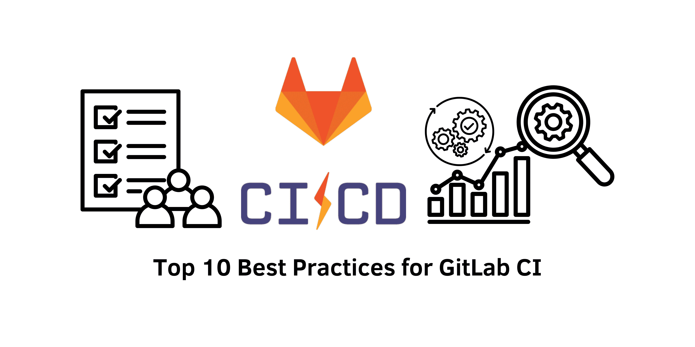

> GitLab CI has emerged as a vital tool for many developers over the past decade, thanks to its extensive capabilities. However, despite its growing popularity and a wealth of online resources, many users find it challenging to distinguish between effective practices and common pitfalls. This can significantly impact their ability to leverage GitLab CI effectively.

## Introduction
This article presents a set of key best practices that will assist developers in enhancing their GitLab CI skills and avoiding frequent mistakes. By adhering to these guidelines, teams can improve their workflows and maximize productivity in their development processes.

&nbsp;

## 1. Leverage Versioned Public CI Docker Images
The foundation of a successful containerized job within GitLab CI relies heavily on the choice of Docker images. Numerous package managers offer well-maintained public Docker images that come with pre-configured settings and dependencies. Regularly updating these images is crucial to avoid the pitfalls associated with the `latest` tag, which can introduce breaking changes and lead to significant debugging challenges.

### Common Pitfall: Custom Docker Images
While the idea of creating custom Docker images might appear straightforward, it often complicates the development process. Establishing a Docker registry, configuring runners to authenticate with it, and managing the registry's storage can become cumbersome. This often leads to custom images becoming 'black boxes' that require careful oversight and planning for upgrades.

### Recommended Strategy: Minor Installations at Runtime
Instead of relying on custom images, consider structuring jobs based on their primary goals and selecting images that align with your development ecosystem. Installing any additional tools during runtime can minimize execution time and decrease reliance on custom solutions. Additionally, configuring runners to utilize local images can help bypass Docker Hub rate limits and enhance performance.

&nbsp;

## 2. Choose Mono-repo for New Projects
When starting a new project, developers are often faced with the decision of using either multiple repositories (multi-repo) or a single repository (mono-repo).

### Multi-repositories:
✅ Requires basic knowledge for setting up pipelines  
❌ Leads to multiple merge requests for a single feature  
❌ Necessitates advanced versioning strategies  
❌ Limited continuous integration and delivery capabilities without sophisticated tooling  
❌ Lacks cache sharing between different modules  

### Mono-repositories:
❌ Requires advanced understanding of pipeline setup  
✅ Simplifies merge requests to a single one per feature  
✅ Eliminates the need for a complex versioning strategy  
✅ Supports continuous integration and delivery without the need for advanced tools  
✅ Allows for cache sharing among modules  

Overall, mono-repos simplify the management of shared code and facilitate the testing of changes, making them an increasingly preferred choice for many developers and organizations.

&nbsp;

## 3. Initiate CI with Local GitLab CI YAML Files
Rather than relying on centralized GitLab templates, it's often more effective to start by developing your CI YAML files locally. Centralization can introduce inefficiencies, such as slow feedback loops and challenges in managing template versions. It's advisable to begin with local YAML files and only move to a centralized system when you encounter multiple identical use cases that warrant it.

&nbsp;

## 4. Utilize Raw Commands in Scripts
While encapsulating commands within scripts may help create consistency between local and remote testing environments, this practice can obscure the execution process and make it difficult to identify errors. Using raw commands in your CI/CD pipelines fosters transparency and clarity. Keep the number of commands per job to a minimum, and leverage appropriate Docker images to simplify the scripts.

&nbsp;

## 5. Implement `workflow:rules` and `rules`
To prevent unnecessary job executions, utilize the `workflow:rules` keyword to dictate when a pipeline is triggered. Additionally, employ the `rules` keyword for finer control over individual job behaviors. It is advisable to avoid the deprecated `only` and `except` keywords, as `rules` encompass all the necessary functionalities.

&nbsp;

## 6. Avoid Code Duplication without YAML Anchors
GitLab CI supports job templates to help eliminate code duplication. Employ the `extends` and `!reference` keywords for effective abstraction. It’s best to avoid YAML anchors, which can complicate the code and limit its scope to the current YAML file. Instead, focus on producing clear and maintainable CI/CD code that is easy to read and modify.

&nbsp;

## 7. Effectively Use Artifacts and Cache
Understanding the distinction between artifacts and cache in GitLab CI is essential for optimizing pipeline performance:

- **Artifacts**: These are used to pass small files between jobs within the same pipeline.  
- **Cache**: This handles larger files to speed up pipelines.  

Using artifacts ensures guaranteed file transmission, while caching helps optimize the performance of repeated downloads. Misusing these features can lead to inefficiencies, so it’s vital to understand their correct applications.

&nbsp;

## 8. Strategically Split Jobs
When designing your pipeline, it’s important to find a balance between using single and multiple jobs. Consider the following factors:

### Single Job:
- Faster pipeline execution  
- More challenging to track progress  
- Risk of exceeding the runner’s log limit  
- Less clarity regarding the causes of failure  

### Multiple Jobs:
- Easier progress tracking  
- Reduced reliance on custom Docker images  
- Improved understanding of failure reasons  

Aim to optimize your pipeline by splitting jobs based on specific requirements while avoiding excessive fragmentation that could complicate the workflow.

&nbsp;

## 9. Optimize the Use of the `needs` Keyword
The `needs` keyword in GitLab CI enables jobs to begin as soon as the jobs they depend on are completed, facilitating parallel job execution. This feature can significantly enhance pipeline efficiency, but it's crucial to avoid overly complex chains that may lead to unstable applications. Using synchronization jobs can help manage intricate pipeline setups effectively.

&nbsp;

## 10. Avoid Downstream Pipelines
### a. Steer Clear of Child Pipelines
Child pipelines operate independently from the main pipeline, leading to complex management issues. They often come with a cumbersome user interface, limited control for the parent pipeline, and complicated artifact synchronization. Whenever possible, it’s advisable to avoid child pipelines.

### b. Limit Multi-Project Pipelines
Multi-project pipelines are designed to trigger workflows in other projects but usually offer limited control and accessibility to artifacts. This method can be unnecessary and is often best avoided by sticking to a mono-repo structure.

&nbsp;

## Conclusion
By implementing these best practices, developers can sidestep common pitfalls and significantly improve their GitLab CI workflows. If you have further tips or insights to share, feel free to contribute in the comments. Together, we can enhance our proficiency with GitLab CI and refine our development processes.

#### References
- GitLab CI/CD Documentation: [GitLab CI/CD](https://docs.gitlab.com/ee/ci/)
- Docker Official Documentation: [Docker Documentation](https://docs.docker.com/)
