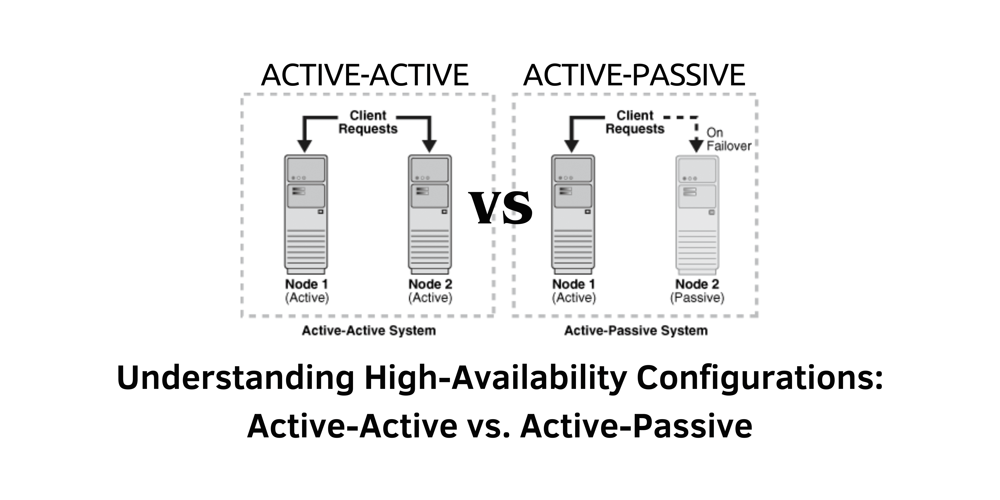

> Specification: Active-Active, Active-Passive, High Availability

## Introduction
In today's digital landscape, where even brief downtime can lead to significant financial losses and dissatisfied customers, configuring high availability in large-scale data networks is crucial. Developers are tasked with ensuring uninterrupted operations while managing vast amounts of data. This article explores two essential high-availability configurations: **Active-Active** and **Active-Passive**, detailing their functions, advantages, ideal use cases, and real-world examples.

&nbsp;

### What Is Active-Active?
An **Active-Active** configuration features multiple nodes that are all simultaneously operational and handling requests. In this setup, every node is actively processing traffic, allowing for redundancy. If one node experiences a failure, the remaining nodes can take over the workload without any service interruption.

### How Active-Active Configuration Functions
Active-Active setups rely on distributing user requests across all operational nodes. This method enhances performance through parallel processing and allows for easy scalability, as additional nodes can be incorporated to meet rising demands without degrading service quality.

### Fault Tolerance in Active-Active
The fault tolerance of Active-Active configurations is attributed to their redundancy. When a node goes down, the workload is redistributed among the remaining nodes, ensuring no data loss and continuity of service. This design allows for efficient utilization of resources.

### Real-World Applications of Active-Active Configurations
Active-Active setups are widely utilized across various industries where high availability and scalability are critical. Some notable examples include:

- **Online Gaming Platforms:** These systems use Active-Active configurations to manage game logic and player interactions across multiple servers, preventing lags and ensuring seamless gameplay during peak times.
  
- **Financial Trading Systems:** In environments demanding rapid data processing, such as high-frequency trading, multiple nodes work simultaneously to handle requests, minimizing the potential for losses due to downtime.

- **Travel Booking Systems:** Active-Active configurations help manage fluctuating user demand for online reservations, ensuring smooth operations even during busy periods.

- **Cloud Applications:** Cloud service providers implement Active-Active setups to improve user experience by directing requests to the nearest available server.

- **E-Commerce Sites:** Large online retailers leverage Active-Active configurations to handle varying traffic levels, ensuring uninterrupted shopping experiences.

- **Social Media Platforms:** These networks use Active-Active setups to support millions of concurrent users, allowing real-time interaction and efficient content distribution.

- **Streaming Services:** Active-Active configurations enable streaming platforms to manage high volumes of user requests for audio and video content without interruptions.

&nbsp;

### What Is Active-Passive?
In contrast, an **Active-Passive** configuration has one node designated as the active instance while others remain in standby mode. The active node handles all incoming requests, and if it fails, a passive node is ready to take over, ensuring continuity.

### How Active-Passive Configuration Operates
Active-Passive setups simplify management by having a single node actively processing requests at any time. The standby nodes monitor the active node’s health and are prepared to assume its responsibilities if needed.

### Benefits of Active-Passive Simplicity
The straightforward nature of Active-Passive configurations leads to easier maintenance and fewer operational complexities. With only one active node, monitoring becomes more efficient.

### Cost-Effectiveness of Active-Passive
Active-Passive configurations can be more economical due to lower hardware needs. Passive nodes do not require the same processing power as the active node, resulting in substantial cost savings while maintaining reliability.

### Common Use Cases for Active-Passive Configurations
Active-Passive setups are typically used in scenarios where reliability and ease of management are essential. Examples include:

- **ERP Systems:** These systems rely on Active-Passive configurations to ensure consistent access to crucial business data, allowing for seamless operations during failovers.

- **Telecommunication Networks:** Active-Passive configurations maintain communication services by ensuring that a standby node can quickly take over if the active node fails.

- **Healthcare Systems:** These setups ensure constant availability of patient data, allowing healthcare providers immediate access to vital information in emergencies.

- **CRM Software:** Active-Passive configurations guarantee that customer support teams can continuously access critical client data, ensuring operational integrity.

- **Online Banking Platforms:** Financial institutions utilize Active-Passive configurations to maintain the availability of their online services, allowing customers to conduct transactions without interruptions.

&nbsp;

### Comparing Active-Active and Active-Passive Configurations
Let’s look at the distinctions between the two configurations:

- **Operational Structure:** Active-Active configurations involve all nodes working simultaneously, which enhances processing capabilities and scalability. In contrast, Active-Passive setups operate with one active node and standby nodes for failover.

- **Scalability:** Active-Active configurations excel in scalability, making them ideal for dynamic workloads, while Active-Passive configurations offer limited scalability since passive nodes are not processing requests.

- **Cost Considerations:** Generally, Active-Passive configurations are more cost-effective due to lower resource requirements, whereas Active-Active setups may incur higher operational costs.

&nbsp;

### Advantages and Disadvantages of Active-Active and Active-Passive
| Configuration     | Advantages                                | Disadvantages                                 |
|-------------------|-------------------------------------------|-----------------------------------------------|
| **Active-Active**  | High scalability, parallel processing, robust fault tolerance | Complexity in setup, potentially higher costs |
| **Active-Passive** | Simplified management, cost-effectiveness, quick failover | Limited scalability, underuse of passive nodes |

&nbsp;

## Conclusion
The decision between Active-Active and Active-Passive configurations is crucial for achieving high availability in extensive data networks. Active-Active setups provide unmatched scalability and fault tolerance, making them suitable for applications that require continuous high performance. On the other hand, Active-Passive configurations, with their straightforwardness and cost-effectiveness, are ideal for scenarios where reliability and efficient failover are critical. Understanding these configurations equips developers with the knowledge to ensure smooth operations amid potential network challenges.

#### References
- Pure Storage: [Active-active vs. Active-passive: Decoding High-availability Configurations for Massive Data Networks](https://blog.purestorage.com/purely-educational/active-active-vs-active-passive-decoding-high-availability-configurations-for-massive-data-networks/) 