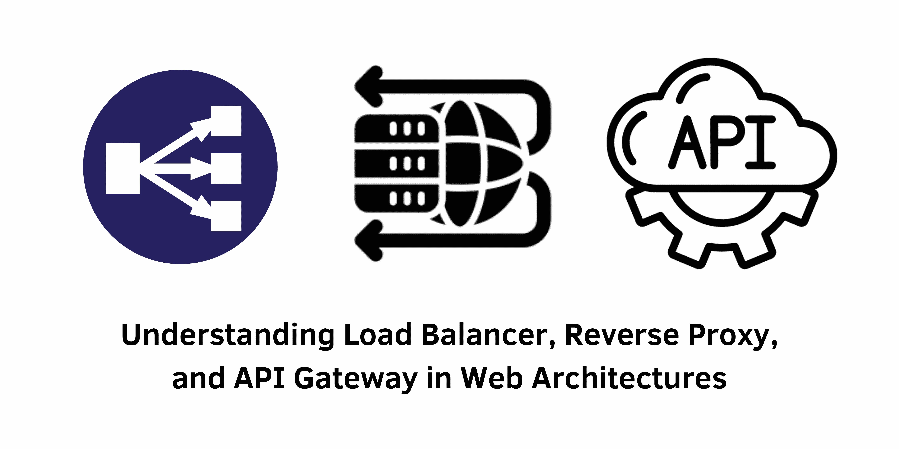

> Specification : Load Balancer, Reverse Proxy, API Gateway, Web Architecture

## Introduction:
In today's digital landscape, businesses heavily rely on digital technologies. As web traffic and data continue to surge, challenges related to server performance, scalability, and security have emerged. Addressing these concerns requires an understanding of key technologies such as load balancers, reverse proxies, and API gateways. Each plays a distinct role in managing web traffic, optimizing infrastructure, and ensuring top-notch performance and security.

---
&nbsp;
#### Load Balancer Overview:
A load balancer acts as a software or hardware solution that efficiently distributes incoming traffic across multiple servers. This mechanism prevents server overload, thereby enhancing performance, uptime, and scalability. For instance, during peak sales on an e-commerce website, a load balancer ensures even traffic distribution across servers, maintaining responsiveness for customers.

#### Reverse Proxy Overview:
Operating in front of server clusters, a reverse proxy directs client requests to the appropriate server. This optimizes performance, bolsters security, and streamlines manageability. It performs functions like load balancing, caching, SSL termination, and serving static content, reducing backend server workload.

#### API Gateway Overview:
An API gateway serves as software that exposes backend services while providing a standardized interface for clients. Simplifying API management and integration, it streamlines client access to multiple APIs. Alongside authentication, rate limiting, and caching, API gateways can transform data formats for consistent client interfaces.

&nbsp;
### Understanding the Functions and Use Cases:

**- Load Balancer Functionality and Use Cases:** Essential for distributing incoming traffic, load balancers enhance reliability and availability. They support various protocols and come in hardware and software forms, catering to high-traffic scenarios like e-commerce and content delivery networks.

**- Reverse Proxy Functionality and Use Cases:** Offering load balancing, caching, and security, reverse proxies enhance website performance and protect against DDoS attacks. They find use in scenarios such as load balancing for web servers and accelerating web applications.

**- API Gateway Functionality and Use Cases:** Serving as a central entry point for microservices architectures, API gateways simplify service composition, inter-service communication, load balancing, management, and security. They're commonly used for mobile applications, partner integrations, legacy system integration, and API management.

&nbsp;
### Choosing the Right Solution for Your Needs:
To select the ideal technology, several factors require consideration: 
- Scalability
- Performance 
- Cost 
- Security
- Management ease
- Standards compliance. 

Hybrid solutions combining these technologies can provide enhanced benefits.

&nbsp;
### Implementing Best Practices:

**- Load Balancer:** Implement at the network level, ensuring server health and responsiveness.

**- Reverse Proxy:** Configure SSL offloading, caching, security policies, and access control lists for optimal functionality.

**- API Gateway:** Ensure gateway server access to backend services, configuring security policies like rate limiting, authentication, and authorization.

&nbsp;
## Conclusion:
Understanding the distinctive roles and functionalities of load balancers, reverse proxies, and API gateways is crucial in optimizing web performance and infrastructure management. By considering each technology's strengths and weaknesses, businesses can select the right solution for their unique requirements, paving the way for enhanced digital experiences.

&nbsp;
#### Reference:
- Design Gurus : https://www.designgurus.io/blog/Load-Balancer-Reverse-Proxy-API-Gateway