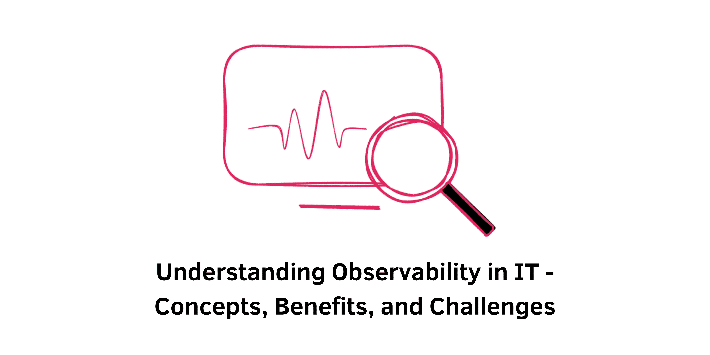

> Specification : Observability

## Introduction:
In the realm of IT operations, Observability plays a pivotal role in understanding system behavior and performance by harnessing various data sources like logs, metrics, and traces. Let's delve deeper into the essence of Observability, its critical concepts, benefits, challenges, and its relevance within the DevOps landscape.

---
### What is Observability in IT?
Observability refers to the capacity to measure a system's current state based on the output data it generates, allowing the understanding of the system's performance and behavior without detailed knowledge of its internal workings.

For instance, in managing a complex e-commerce website with multiple microservices, Observability enables asking pertinent questions such as the average response time, error rates, latency in specific services, or the impact on various types of requests during a slowdown.

### Difference Between Observability & Monitoring
Observability transcends monitoring by not just alerting when predefined metrics cross thresholds but by providing a deeper understanding of why a system fails. Monitoring focuses on known issues and predefined metrics, while Observability involves exploratory analysis to diagnose unforeseen problems.

### Key Concepts of Observability: 
**1. Metrics:** Numerical representations of system data over time (e.g., response times, request counts) aiding in understanding system states.

**2. Logs:** Recorded events in an application detailing timestamps, severity, and descriptions, enabling debugging and forensic analysis.

**3. Traces:** Detailed tracking of requests across services in distributed systems, vital in understanding performance bottlenecks.

### Challenges in Observability
Organizations encounter hurdles such as managing data silos, coping with the volume, speed, and complexity of data, a lack of pre-production observation, and the time-consuming nature of troubleshooting without comprehensive Observability tools.

### Why is Observability Important?
Observability empowers cross-functional teams to identify and fix performance issues swiftly, understand user experience impact, align software releases with business goals, and automate tasks for increased productivity.

### Benefits of Observability
- Enhances application performance monitoring and automates tasks.
- Fosters DevSecOps and SRE practices for stronger, secure, and resilient applications.
- Facilitates efficient infrastructure, cloud, and Kubernetes monitoring.
- Elevates end-user experience by preemptively addressing issues.

### How Does Observability Relate to DevOps?
Observability is integral to the DevOps process, enabling real-time issue detection, debugging, performance optimization, and continuous improvement in software and infrastructure.

### Getting Started with Observability
Initiating Observability involves defining business goals, selecting relevant metrics, leveraging event logs, visualizing data effectively, and choosing the right Observability platform based on business needs and technical proficiency.

&nbsp;
## Conclusion:
Implementing Observability isn't solely about tool adoption; it's about aligning with business objectives, choosing the right metrics, capturing event logs, and visualizing data meaningfully. Successful Observability ensures timely issue resolution, performance enhancement, and overall system resilience, delivering an enhanced user experience and supporting business objectives effectively.

&nbsp;
#### Reference:
- DevOpsCube : https://devopscube.com/what-is-observability/