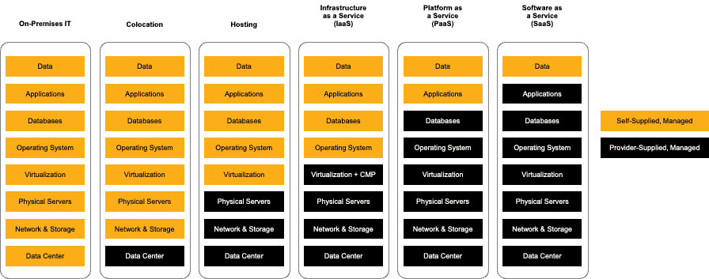

> Specification : Cloud Computing

## Introduction :
Cloud computing has become an essential element in our digital era, powering a wide range of applications, from social media platforms to online banking systems. However, many individuals still struggle to grasp the concept and workings of cloud computing. This comprehensive guide aims to demystify cloud computing by providing insights into its history, development, characteristics, and how it enables businesses to deploy applications with speed, reliability, and strategic advantage.

&nbsp;

### What is Cloud Computing?
Cloud computing entails the delivery of computing services, including servers, storage, databases, networking, software, analytics, and intelligence, over the internet (commonly referred to as "the cloud"). This service allows users to access and utilize resources on a pay-as-you-go basis, eliminating the need to manage the underlying infrastructure. Think of cloud computing as a customizable buffet, where businesses can select and leverage the specific services they require without the burden of owning and maintaining the entire infrastructure.

### History of Cloud Computing:
The roots of cloud computing can be traced back to the 1960s when visionary computer scientist J.C.R. Licklider conceptualized a global network that would connect people to data and applications from any location. However, cloud computing, as we know it today, began taking shape in the early 2000s. The launch of Amazon Web Services (AWS) in 2006 marked the emergence of widely accessible cloud computing platforms. Since then, major players like Microsoft Azure, Google Cloud, and IBM Cloud have entered the market, fostering innovation and healthy competition.

&nbsp;

### Characteristics of Cloud Computing:
To be classified as cloud computing, a system must possess the following key characteristics:

1. On-demand self-service: Cloud computing empowers users to access and configure resources as needed, without requiring intervention from the service provider. For instance, a startup can swiftly scale up server capacity during a product launch using AWS, without investing in additional hardware.

2. Broad network access: Cloud services are accessible via the internet, enabling users to leverage resources from any device with an internet connection. This facilitates seamless collaboration among remote teams, regardless of their physical locations.

3. Resource pooling: Cloud providers employ shared pools of computing resources, allowing multiple customers to benefit from efficient resource allocation and cost savings. A prime example is Netflix, which utilizes Amazon's resource pool to efficiently stream content to millions of users worldwide.

4. Rapid elasticity: Cloud computing resources can be easily scaled up or down to meet fluctuating demand. This flexibility is invaluable for businesses experiencing varying workloads, such as e-commerce stores during peak shopping seasons.

5. Measured service: In cloud computing, users only pay for the resources they consume, similar to paying for utilities. This pay-as-you-go model enables businesses to optimize their spending and avoid unnecessary resource wastage.

&nbsp;

### Benefits of Cloud Computing:

source : https://dcloud.co.id/

Cloud computing offers numerous advantages over traditional on-premises systems. Here are some key benefits:

1. Infrastructure as a Service (IaaS): IaaS provides virtualized computing resources over the internet, allowing businesses to rent infrastructure components such as virtual machines, storage, and networking. This eliminates the need for significant capital investments in physical hardware. For instance, Dropbox leverages IaaS to store and manage vast amounts of user data, enabling quick application deployment and scalability.

2. Platform as a Service (PaaS): PaaS offers a platform that empowers developers to build, test, and deploy applications without worrying about the underlying infrastructure. This accelerates the development process and reduces time to market. Heroku, a renowned PaaS provider, enables developers to deploy and manage applications with minimal effort, freeing them to focus on writing code.

3. High Availability: Cloud computing incorporates redundant components and systems designed to minimize downtime and ensure uninterrupted operation of applications and services. Techniques like load balancing and automatic failover are employed by cloud providers to distribute workloads across multiple servers. Companies leveraging services like AWS can take advantage of multiple availability zones, maintaining application performance and uptime even during unexpected events.

4. High Scalability: Cloud computing allows businesses to easily scale computing resources up or down as required. This scalability is invaluable for handling fluctuating workloads, traffic surges, and unexpected demands. For example, an online retailer can rapidly scale resources during the holiday shopping season to accommodate increased traffic without compromising website performance, a feat challenging to achieve with traditional on-premises infrastructure.

5. Multi-Region Deployment: Cloud computing facilitates the deployment of applications across multiple regions, enhancing reliability and reducing latency for users. If an issue arises in one region, the application seamlessly transitions to another region, ensuring continuity with minimal disruption. Spotify utilizes multi-region deployment to provide uninterrupted music streaming services to users worldwide, even during regional outages or maintenance.

&nbsp;

## Conclusion:
In conclusion, cloud computing has brought about a revolutionary change in the way businesses deploy and manage applications, offering numerous advantages over traditional computing methods. Its on-demand nature, resource pooling, rapid elasticity, and measured service empower companies to develop and deploy applications faster and more reliably. As cloud computing continues to evolve, businesses that embrace and harness these technologies strategically will remain competitive in the ever-changing digital landscape.

&nbsp;
#### Reference:
- 8grams : https://8grams.medium.com/cloud-computing-the-fundamental-51b50b84c76a